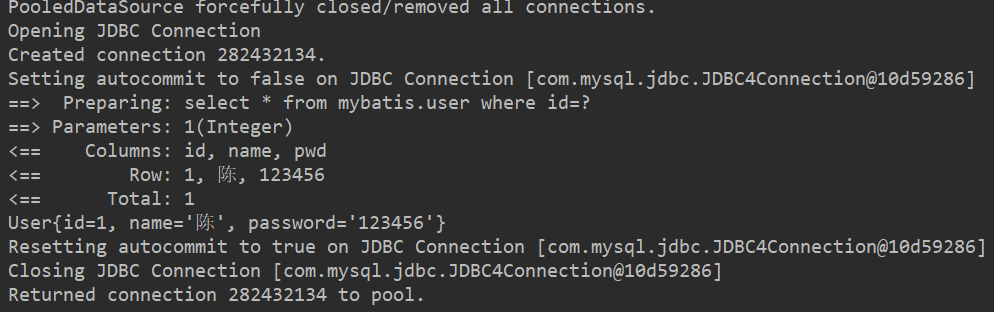
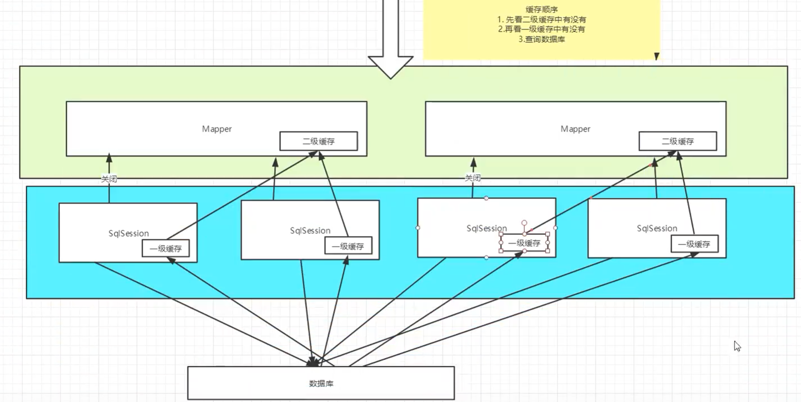

# 1 MyBatis

## 1.1 简介

持久层框架，支持定制化sql，存储过程以及高级映射

maven仓库

```xml
<!-- https://mvnrepository.com/artifact/org.mybatis/mybatis -->
<dependency>
    <groupId>org.mybatis</groupId>
    <artifactId>mybatis</artifactId>
    <version>3.5.6</version>
</dependency>
```

GitHub:https://github.com/mybatis/mybatis-3

中文注释:https://github.com/tuguangquan/mybatis


## 1.2 持久化

数据持久化

​	持久化就是将程序大数据在持久状态和瞬时状态转化的过程

​	内存:断电即失

​	数据库,io文件持久化

为什么需要持久化?

​	有一些对象不能丢掉

​	内存贵

## 1.3 持久层

Dao Service	controller

​	完成持久化工作的代码块

​	层界限十分明显

## 1.4 为什么需要MyBatis?

方便

传统jdbc代码复杂.简化,框架

不用Mybatis也可以,更容易上手,技术没有高低之分

优点:提供xml标签,支持动态编写sql


最重要一点:**使用的人多**


# 2 第一个Mybatis程序

**思路:搭建环境-->导入Mybatis-->编写代码-->测试**

## 2.1 搭建环境

1.搭建数据库

```mysql
CREATE DATABASE `mybatis`;

USE `mybatis`;

CREATE TABLE `user`(
  `id` INT(20) NOT NULL PRIMARY KEY,
  `name` VARCHAR(30) DEFAULT NULL,
  `pwd` VARCHAR(30) DEFAULT NULL
)ENGINE=INNODB DEFAULT CHARSET=utf8 ;


INSERT INTO `user`(`id`,`name`,`pwd`) VALUES
(1,'陈','123456'),
(2,'恒','123456'),
(3,'飞','123456')
```

2.新建一个项目,将src目录删除

3.导入依赖	mysql-connector包	junit	mybatis包

```xml
<dependencies>
    <dependency>
        <groupId>mysql</groupId>
        <artifactId>mysql-connector-java</artifactId>
        <version>5.1.47</version>
    </dependency>
    <dependency>
        <groupId>junit</groupId>
        <artifactId>junit</artifactId>
        <version>4.11</version>
    </dependency>
    <!-- https://mvnrepository.com/artifact/org.mybatis/mybatis -->
    <dependency>
        <groupId>org.mybatis</groupId>
        <artifactId>mybatis</artifactId>
        <version>3.5.6</version>
    </dependency>
</dependencies>
```

## 2.2 创建一个模块

1.创建核心配置文件

```xml
<?xml version="1.0" encoding="UTF-8" ?>
<!DOCTYPE configuration
        PUBLIC "-//mybatis.org//DTD Config 3.0//EN"
        "http://mybatis.org/dtd/mybatis-3-config.dtd">
<!--核心配置文件-->
<configuration>

    <environments default="development">
        <environment id="development">
            <!--事务管理-->
            <transactionManager type="JDBC"/>
            <dataSource type="POOLED">
                <property name="driver" value="com.mysql.jdbc.Driver"/>
                <property name="url" value="jdbc:mysql://localhost:3306/mybatis?useSSL=true&amp;useUnicode=true&amp;characterEncoding=UTF-8"/>
                <property name="username" value="root"/>
                <property name="password" value="123456"/>
            </dataSource>
        </environment>
    </environments>

</configuration>
```

2.编写Mybatis工具类

```java
//使用Mybatis获取sqlSessionFactory对象
public class MybatisUtils {
    private static SqlSessionFactory sqlSessionFactory;
    //使用Mybatis获取sqlSessionFactory对象
    static {
        try {
            String resource = "mybatis-config.xml";
            InputStream inputStream = Resources.getResourceAsStream(resource);
            sqlSessionFactory = new SqlSessionFactoryBuilder().build(inputStream);
        } catch (IOException e) {
            e.printStackTrace();
        }
    }

    //既然有了 SqlSessionFactory，顾名思义，我们可以从中获得 SqlSession 的实例。
    //org.apache.ibatis.session.SqlSession 提供了在数据库执行 org.apache.ibatis.jdbc.SQL 命令所需的所有方法。
    //你可以通过 SqlSession 实例来直接执行已映射的 SQL 语句。
    public static SqlSession getSqlSession(){
        return sqlSessionFactory.openSession();
    }
}
```

## 2.3 编写代码

11.实体类

```java
package com.kuang.pojo;

public class User {
    private int id;
    private String name;
    private String pwd;

    public User() {
    }

    public User(int id, String name, String pwd) {
        this.id = id;
        this.name = name;
        this.pwd = pwd;
    }

    public int getId() {
        return id;
    }

    public void setId(int id) {
        this.id = id;
    }

    public String getName() {
        return name;
    }

    public void setName(String name) {
        this.name = name;
    }

    public String getPwd() {
        return pwd;
    }

    public void setPwd(String pwd) {
        this.pwd = pwd;
    }

    @Override
    public String toString() {
        return "User{" +
                "id=" + id +
                ", name='" + name + '\'' +
                ", pwd='" + pwd + '\'' +
                '}';
    }
}
```

2.Dao接口

```java
public interface UserDao {
    List<User> getUserList();
}
```

3.接口实现类

```xml
<?xml version="1.0" encoding="UTF-8" ?>
<!DOCTYPE mapper
        PUBLIC "-//mybatis.org//DTD Mapper 3.0//EN"
        "http://mybatis.org/dtd/mybatis-3-mapper.dtd">
<!--namespace=绑定一个对应的Dao/Mapper接口-->
<mapper namespace="com.kuang.dao.UserDao">
    <!--select-->
    <select id="getUserList" resultType="com.kuang.pojo.User">
        select * from mybatis.user
    </select>
</mapper>
```

## 2.4 测试

注意点:Mapper注册是什么?

`org.apache.ibatis.binding.BindingException: Type interface com.kuang.dao.UserDao is not known to the MapperRegistry.`

核心注册文件中注册mappers

```xml
<mappers>
    <mapper resource="com/kuang/dao/UserMapper.xml"/>
</mappers>
```

测试代码:

```java
@Test
public void test(){
    //获得sqlSession对象
    SqlSession sqlSession = MybatisUtils.getSqlSession();

    //方式一:执行SQL
    UserDao mapper = sqlSession.getMapper(UserDao.class);
    List<User> userList = mapper.getUserList();
    
    for (User user : userList) {
        System.out.println(user);
    }
    sqlSession.close();

}
```

# 3 CURD

## 1 namespace

namespace中的包名要和Dao/mapper接口的包名一致

## 2 select

选择 查询语句

​	id:对应namespace中的方法名

​	resultType:sql语句执行的返回值

​	parameterType参数类型

```xml
 <!--select-->
    <select id="getUserList" resultType="com.kuang.pojo.User" >
        select * from mybatis.user
    </select>

    <select id="getUserById" resultType="com.kuang.pojo.User" parameterType="int">
        select * from mybatis.user where id = #{id}
    </select>

    <!--对象中的属性,可以直接取出来-->
    <insert id="addUser" parameterType="com.kuang.pojo.User">
        insert into mybatis.user (id, name, pwd) values (#{id},#{name},#{pwd})
    </insert>

    <update id="updateUser" parameterType="com.kuang.pojo.User">
        update mybatis.user set name=#{name},pwd=#{pwd} where id=#{id}
    </update>

    <delete id="deleteUser" parameterType="int">
        delete from mybatis.user where id=#{id}
    </delete>
```

## 3 万能Map

实体类或者数据库中的表，字段或者参数过多，应当考虑使用Map

```java

@Test
    public void test6(){

        SqlSession sqlSession = MybatisUtils.getSqlSession();
        UserMapper mapper = sqlSession.getMapper(UserMapper.class);
        //万能map的用法
        HashMap<String, Object> map = new HashMap<String, Object>();

        map.put("userid",5);
        map.put("userName","hello");
        map.put("userPassword","545657");
        mapper.addUser2(map);
        sqlSession.close();
    }
```

```xml

<!--万能map-->
    <insert id="addUser2" parameterType="map">
        insert into mybatis.user (id, name, pwd) values (#{userid},#{userName},#{userPassword})
    </insert>
```

Map传递参数们直接在sql中取出key即可	parameterType="map"

对象传递参数，直接在sql中去对象的属性即可

只有一个基本类型参数的情况下，直接在sql中取到

多个参数用Map，或者注解

## 4 模糊查询

Java代码，1.模糊查询使用通配符 %%	2.sql拼接中使用拼接符

# 4 配置解析

## 1核心配置文件

mybatis-config.xml

Mybatis的配置文件包含了会深深影响Mybatis行为的设置和属性信息

```xml
configuration（配置）
properties（属性）
settings（设置）
typeAliases（类型别名）
typeHandlers（类型处理器）
objectFactory（对象工厂）
plugins（插件）
environments（环境配置）
environment（环境变量）
transactionManager（事务管理器）
dataSource（数据源）
databaseIdProvider（数据库厂商标识）
mappers（映射器）
```


## 2 环境配置

Mybatis可以配置成适应多种环境

尽管可以配置多个环境，但每个SqlSessionFactory实例只能选择一种环境

## 3 属性

通过peoperties属性实现引用配置文件

这些属性都是可外部配置且动态替换的，既可以在典型的Java属性文件中配置，亦可通过properties元素的子元素来传递【db.properties】

1.编写一个配置文件

```properties
driver=com.mysql.jdbc.Driver
url=jdbc:mysql://localhost:3306/mybatis?useSSL=true&userUnicode=true&characterEncoding=UTF-8
name=root
password=123456
```

2.在核心配置文件中引入

```xml
<!--引入外部配置文件-->
<properties resource="db.properties">
    <property name="username" value="root"/>
    <property name="password" value="123456"/>
</properties>
```

可以直接引入外部文件

可以在其中增加一些属性配置

如果两个文件有同一个字段，优先使用外部文件的字段

## 4 类型别名

类型别名可为 Java 类型设置一个缩写名字。 它仅用于 XML 配置，意在降低冗余的全限定类名书写。例如：

```xml
<!--给实体类起别名-->
<typeAliases>
    <typeAlias type="com.kuang.pojo.User" alias="User"/>
</typeAliases>
```

## 5.映射器

MapperRegistry:注册绑定Mapper文件

方式一：

```xml
<!--每一个Mapper.xml都需要在Mybatis核心配置文件中注册,如果映射不成功需要
    在build中配置resources,来防止我们资源导出失败的问题-->
    <mappers>
        <mapper resource="com\kuang\dao\UserMapper.xml"/>
    </mappers>
```

## 6 生命周期和作用域

作用域和生命周期类别是至关重要的，因为错误的使用会导致非常严重的**并发问题。**


> **SqlSessionFactoryBuilder**

一旦创建就不需要了

局部变量

> **SqlSessionFactory**

可以想象为数据库连接池,需要一直存在,没有任何理由丢弃重新创建另一个实例

最简单的就是使用单例模式或者静态单例模式

> **SqlSession**

连接到连接池的一个请求

SqlSession 的实例不是线程安全的，因此是不能被共享的，所以它的最佳的作用域是请求或方法作用域,用完之后需要赶紧关闭,否则占用资源.

每一个Mapper就代表一个具体的业务

```
sqlSession.close();
```


# 5 ResultMap解决属性名和字段名不一致的问题

属性名和字段名不一致

## 1问题

## 2resultMap

结果集映射，将实体类中的属性映射到数据库

```xml
<resultMap id="UserMap" type="User">
    <!--column数据库中的字段，property实体类中的属性-->
    <result column="id" property="id"/>
    <result column="name" property="name"/>
    <result column="pwd" property="password"/>
</resultMap>
<select id="getUserById" resultMap="UserMap">
    select * from mybatis.user where id=#{id}
</select>
```

# 6 日志

## 6.1 日志工厂

如果一个数据库操作出现了异常，需要排错，日志就是最好的选择。

SLF4J 

LOG4J(deprecated since 3.5.9) 

LOG4J2 

JDK_LOGGING 

COMMONS_LOGGING 

STDOUT_LOGGING 掌握

NO_LOGGING

在mybatis中具体使用哪个日志实现，在设置中设定

```xml
<settings>
    <setting name="logImpl" value="STDOUT_LOGGING"/>
</settings>
```




## 6.2 Log4j

1.先导入包

```xml

<!-- https://mvnrepository.com/artifact/log4j/log4j -->
<dependency>
    <groupId>log4j</groupId>
    <artifactId>log4j</artifactId>
    <version>1.2.17</version>
</dependency>

```


2.log4j配置

```properties
### 配置根 ###
log4j.rootLogger = debug,console ,fileAppender,dailyRollingFile,ROLLING_FILE,MAIL,DATABASE

### 设置输出sql的级别，其中logger后面的内容全部为jar包中所包含的包名 ###
log4j.logger.org.apache=dubug
log4j.logger.java.sql.Connection=dubug
log4j.logger.java.sql.Statement=dubug
log4j.logger.java.sql.PreparedStatement=dubug
log4j.logger.java.sql.ResultSet=dubug
### 配置输出到控制台 ###
log4j.appender.console = org.apache.log4j.ConsoleAppender
log4j.appender.console.Target = System.out
log4j.appender.console.layout = org.apache.log4j.PatternLayout
log4j.appender.console.layout.ConversionPattern =  %d{ABSOLUTE} %5p %c{ 1 }:%L - %m%n

### 配置输出到文件 ###
log4j.appender.fileAppender = org.apache.log4j.FileAppender
log4j.appender.fileAppender.File = logs/log.log
log4j.appender.fileAppender.Append = true
log4j.appender.fileAppender.Threshold = DEBUG
log4j.appender.fileAppender.layout = org.apache.log4j.PatternLayout
log4j.appender.fileAppender.layout.ConversionPattern = %-d{yyyy-MM-dd HH:mm:ss}  [ %t:%r ] - [ %p ]  %m%n

### 配置输出到文件，并且每天都创建一个文件 ###
log4j.appender.dailyRollingFile = org.apache.log4j.DailyRollingFileAppender
log4j.appender.dailyRollingFile.File = logs/log.log
log4j.appender.dailyRollingFile.Append = true
log4j.appender.dailyRollingFile.Threshold = DEBUG
log4j.appender.dailyRollingFile.layout = org.apache.log4j.PatternLayout
log4j.appender.dailyRollingFile.layout.ConversionPattern = %-d{yyyy-MM-dd HH:mm:ss}  [ %t:%r ] - [ %p ]  %m%n### 配置输出到文件，且大小到达指定尺寸的时候产生一个新的文件 ###log4j.appender.ROLLING_FILE=org.apache.log4j.RollingFileAppender log4j.appender.ROLLING_FILE.Threshold=ERROR log4j.appender.ROLLING_FILE.File=rolling.log log4j.appender.ROLLING_FILE.Append=true log4j.appender.ROLLING_FILE.MaxFileSize=10KB log4j.appender.ROLLING_FILE.MaxBackupIndex=1 log4j.appender.ROLLING_FILE.layout=org.apache.log4j.PatternLayout log4j.appender.ROLLING_FILE.layout.ConversionPattern=[framework] %d - %c -%-4r [%t] %-5p %c %x - %m%n

### 配置输出到邮件 ###
log4j.appender.MAIL=org.apache.log4j.net.SMTPAppender
log4j.appender.MAIL.Threshold=FATAL
log4j.appender.MAIL.BufferSize=10
log4j.appender.MAIL.From=chenyl@yeqiangwei.com
log4j.appender.MAIL.SMTPHost=mail.hollycrm.com
log4j.appender.MAIL.Subject=Log4J Message
log4j.appender.MAIL.To=chenyl@yeqiangwei.com
log4j.appender.MAIL.layout=org.apache.log4j.PatternLayout
log4j.appender.MAIL.layout.ConversionPattern=[framework] %d - %c -%-4r [%t] %-5p %c %x - %m%n

### 配置输出到数据库 ###
log4j.appender.DATABASE=org.apache.log4j.jdbc.JDBCAppender
log4j.appender.DATABASE.URL=jdbc:mysql://localhost:3306/test
log4j.appender.DATABASE.driver=com.mysql.jdbc.Driver
log4j.appender.DATABASE.user=root
log4j.appender.DATABASE.password=
log4j.appender.DATABASE.sql=INSERT INTO LOG4J (Message) VALUES ('[framework] %d - %c -%-4r [%t] %-5p %c %x - %m%n')
log4j.appender.DATABASE.layout=org.apache.log4j.PatternLayout
log4j.appender.DATABASE.layout.ConversionPattern=[framework] %d - %c -%-4r [%t] %-5p %c %x - %m%n
log4j.appender.A1=org.apache.log4j.DailyRollingFileAppender
log4j.appender.A1.File=SampleMessages.log4j
log4j.appender.A1.DatePattern=yyyyMMdd-HH'.log4j'
log4j.appender.A1.layout=org.apache.log4j.xml.XMLLayout
```

3.配置为log4j的实现

```xml
<settings>
    <setting name="logImpl" value="LOG4J"/>
</settings>
```

 4.简单使用

```
19:52:24,174 DEBUG org.apache.ibatis.logging.LogFactory:105 - Logging initialized using 'class org.apache.ibatis.logging.log4j.Log4jImpl' adapter.
19:52:24,180 DEBUG org.apache.ibatis.logging.LogFactory:105 - Logging initialized using 'class org.apache.ibatis.logging.log4j.Log4jImpl' adapter.
19:52:24,187 DEBUG org.apache.ibatis.io.VFS:116 - Class not found: org.jboss.vfs.VFS
19:52:24,187 DEBUG org.apache.ibatis.io.JBoss6VFS:149 - JBoss 6 VFS API is not available in this environment.
19:52:24,188 DEBUG org.apache.ibatis.io.VFS:116 - Class not found: org.jboss.vfs.VirtualFile
19:52:24,195 DEBUG org.apache.ibatis.io.VFS:64 - VFS implementation org.apache.ibatis.io.JBoss6VFS is not valid in this environment.
19:52:24,197 DEBUG org.apache.ibatis.io.VFS:74 - Using VFS adapter org.apache.ibatis.io.DefaultVFS
19:52:24,199 DEBUG org.apache.ibatis.io.DefaultVFS:224 - Find JAR URL: file:/F:/8.Java%e4%bb%a3%e7%a0%81/Mybatis-Study/mybatis-04/target/classes/com/kuang/pojo
19:52:24,200 DEBUG org.apache.ibatis.io.DefaultVFS:251 - Not a JAR: file:/F:/8.Java%e4%bb%a3%e7%a0%81/Mybatis-Study/mybatis-04/target/classes/com/kuang/pojo
19:52:24,266 DEBUG org.apache.ibatis.io.DefaultVFS:101 - Reader entry: User.class
19:52:24,267 DEBUG org.apache.ibatis.io.DefaultVFS:115 - Listing file:/F:/8.Java%e4%bb%a3%e7%a0%81/Mybatis-Study/mybatis-04/target/classes/com/kuang/pojo
19:52:24,268 DEBUG org.apache.ibatis.io.DefaultVFS:224 - Find JAR URL: file:/F:/8.Java%e4%bb%a3%e7%a0%81/Mybatis-Study/mybatis-04/target/classes/com/kuang/pojo/User.class
19:52:24,268 DEBUG org.apache.ibatis.io.DefaultVFS:251 - Not a JAR: file:/F:/8.Java%e4%bb%a3%e7%a0%81/Mybatis-Study/mybatis-04/target/classes/com/kuang/pojo/User.class
19:52:24,270 DEBUG org.apache.ibatis.io.DefaultVFS:101 - Reader entry: ����   1 <
19:52:24,271 DEBUG org.apache.ibatis.io.ResolverUtil:288 - Checking to see if class com.kuang.pojo.User matches criteria [is assignable to Object]
19:52:24,320 DEBUG org.apache.ibatis.datasource.pooled.PooledDataSource:363 - PooledDataSource forcefully closed/removed all connections.
19:52:24,322 DEBUG org.apache.ibatis.datasource.pooled.PooledDataSource:363 - PooledDataSource forcefully closed/removed all connections.
19:52:24,322 DEBUG org.apache.ibatis.datasource.pooled.PooledDataSource:363 - PooledDataSource forcefully closed/removed all connections.
19:52:24,322 DEBUG org.apache.ibatis.datasource.pooled.PooledDataSource:363 - PooledDataSource forcefully closed/removed all connections.
19:52:24,530 DEBUG org.apache.ibatis.transaction.jdbc.JdbcTransaction:137 - Opening JDBC Connection
```


# 7.分页

减少数据的处理量

**使用limit分页**

# 8 使用注解开发

## 8.2 使用注解开发

1.注解在接口上实现

```java
@Select("select * from user")
List<User> getUsers();
```

2.需要在核心配置文件中绑定接口

```java
<mappers>
    <mapper class="com.kuang.dao.UserMapper"/>
</mappers>
```

3.测试使用

本质是反射实现，底层使用动态代理

## 8.3 CRUD

```java
//工具类
public class MybatisUtils {
    //SqlSessionFactory
    private static SqlSessionFactory sqlSessionFactory;
    //使用Mybatis获取sqlSessionFactory对象
    static {
        try {
            String resource = "mybatis-config.xml";
            InputStream inputStream = Resources.getResourceAsStream(resource);
            sqlSessionFactory = new SqlSessionFactoryBuilder().build(inputStream);
        } catch (IOException e) {
            e.printStackTrace();
        }
    }

    //既然有了 SqlSessionFactory，顾名思义，我们可以从中获得 SqlSession 的实例。
    //org.apache.ibatis.session.SqlSession 提供了在数据库执行 org.apache.ibatis.jdbc.SQL 命令所需的所有方法。
    //你可以通过 SqlSession 实例来直接执行已映射的 SQL 语句。
    public static SqlSession getSqlSession(){
        //参数可为空也可设置为自动提交
        return sqlSessionFactory.openSession(true);
    }
}
```

可以实现在创建的时候自动提交事务

增删改返回值都是int

```java
public interface UserMapper {

    @Select("select * from user")
    List<User> getUsers();

    //方法存在多个参数,所有的参数前面必须添加@param
    @Select("select * from user where id=#{id}")
    User getUserById(@Param("id")int id);

    @Insert("insert into user(id,name,pwd) values (#{id},#{name},#{password})")
    int addUser(User user);

    //更新
    @Update("update user set name=#{name},pwd=#{password} where id=#{id}")
    int updateUser(User user);

    @Delete("delete from user where id=#{id}")
    //删除
    int deleteUser(@Param("id")int id);

}
```

【注意：接口必须注册绑定在核心配置文件中】

**关于@param**

基本类型和string类型需要加上

引用类型不需要加

如果只有一个基本类型，可以忽略，但是建议加上

```xml
<mappers>
    <mapper class="com.kuang.dao.UserMapper"/>
</mappers>
```

# 9 Lombok

简化操作，使用注解开发

使用这个插件可以省略掉实体类的get/set/toString等构造方法，需要在实体类上添加@Data注解

1.下载lombok插件

2.添加maven lombok依赖的jar包

```xml
<!-- https://mvnrepository.com/artifact/org.projectlombok/lombok -->
<dependency>
    <groupId>org.projectlombok</groupId>
    <artifactId>lombok</artifactId>
    <version>1.18.10</version>
</dependency>
```

常用的一些注解方法

@Getter and @Setter
@FieldNameConstants
@ToString
@EqualsAndHashCode
@AllArgsConstructor, @RequiredArgsConstructor and @NoArgsConstructor
@Log, @Log4j, @Log4j2, @Slf4j, @XSlf4j, @CommonsLog, @JBossLog, @Flogger, @CustomLog
@Data
@Builder
@SuperBuilder
@Singular
@Delegate
@Value
@Accessors
@Wither
@With
@SneakyThrows

**缺点：**

1.不支持参数构造器重载

2.省去了手动创建getter setter方法的麻烦，但降低了源代码的可读性和完整性，降低了阅读源代码的舒适度

使用lombok仍然需要再配置核心文件mybatis-config.xml中注册mapper

# 10 多对一处理

对于学生，**关联**，多个学生关联一个老师【多对一】

对于老师，**集合**，一个老师，有很多学生【一对多】


```java
public class MyTest {
    public static void main(String[] args) {
        SqlSession sqlSession = MybatisUtils.getSqlSession();
        //这里写的是接口类TeacherMapper.class而不是实体类
        TeacherMapper mapper = sqlSession.getMapper(TeacherMapper.class);
        Teacher teacher = mapper.getTeacher(1);
        System.out.println(teacher);

    }
}
```


测试环境搭建:

1.导入lombok

2.新建实体类Teacher Student

3.建立mapper接口

4.建立Mapper.xml文件

```xml
<?xml version="1.0" encoding="UTF-8" ?>
<!DOCTYPE mapper
        PUBLIC "-//mybatis.org//DTD Config 3.0//EN"
        "http://mybatis.org/dtd/mybatis-3-mapper.dtd">
<mapper namespace="com.kuang.dao.StudentMapper">

</mapper>
```

5.在核心配置文件中绑定注册Mapper接口或者文件

6.测试查询是否链接成功

## 10.1 通过resultMap进行复杂查询


```java
@Data
public class Student {
    private int id;
    private String name;

    //private学生要关联一个老师
    private Teacher teacher;
}
```

## 10.1.按照查询嵌套处理

由于这里查询学生得到老师字段列的结果为空:通过结果集映射联表查询

```xml
<?xml version="1.0" encoding="UTF-8" ?>
<!DOCTYPE mapper
        PUBLIC "-//mybatis.org//DTD Config 3.0//EN"
        "http://mybatis.org/dtd/mybatis-3-mapper.dtd">
<mapper namespace="com.kuang.dao.StudentMapper">
    <!--查询出来老师的思路-->
    <!--
        1.查询所有的学生信息
        2.根据查询出来的学生tid，寻找对应的老师
    -->
    <select id="getStudent" resultMap="StudentTeacher">
        select * from student;
    </select>

    <!--使用结果集映射查询学生老师-->
    <resultMap id="StudentTeacher" type="Student">
        <result property="id" column="id"/>
        <result property="name" column="name"/>
        <!--<result property=""-->
        <!-- 复杂的属性,需要单独处理   -->
        <association property="teacher" column="tid" javaType="Teacher" select="getTeacher"/>
    </resultMap>

    <select id="getTeacher" resultType="Teacher">
        select *from  teacher where id=#{id}
    </select>
</mapper>
```

```xml
<?xml version="1.0" encoding="UTF-8" ?>
<!DOCTYPE mapper
        PUBLIC "-//mybatis.org//DTD Config 3.0//EN"
        "http://mybatis.org/dtd/mybatis-3-mapper.dtd">
<mapper namespace="com.kuang.dao.TeacherMapper">

</mapper>
```

## 10.2 按照结果嵌套处理

```xml
<select id="getStudent" resultMap="StudentTeacher">
    select s.id sid,s.name sname,t.id tid,t.name tname
    from student s,teacher t
    where s.tid=t.id
</select>

<resultMap id="StudentTeacher" type="Student">
    <result property="id" column="sid"/>
    <result property="name" column="sname"/>
    <association property="teacher" javaType="Teacher">
        <result property="name" column="tname"/>
        <result property="id" column="tid"/>
    </association>
</resultMap>
```

## 10.3 联表查询

```sql
select s.id sid,s.name sname,t.id tid,t.name tname
from student s,teacher t
where s.tid=t.id
```

# 11 一对多处理

比如:一个老师,拥有多个学生

环境搭建:

1.实体类

```java
@Data
public class Student {
    private int id;
    private String name;

    //private学生要关联一个老师
    private int tid;
}
```

```java
@Data
public class Teacher {
    private int id;
    private String name;
    //一个老师有多个学生
    private List<Student> students;
}
```

2.TeacherMapper

```java
public interface TeacherMapper {
    //获取老师
    //List<Teacher> getTeacher();
    //获取指定老师下的所有学生及老师信息
    Teacher getTeacher(@Param("tid")int id);
}
```

3.按照结果集嵌套查询，TeacherMapper.xml,通过结果做映射

```java
<?xml version="1.0" encoding="UTF-8" ?>
<!DOCTYPE mapper
        PUBLIC "-//mybatis.org//DTD Config 3.0//EN"
        "http://mybatis.org/dtd/mybatis-3-mapper.dtd">
<mapper namespace="com.kuang.dao.TeacherMapper">

    <!--1.按照结果嵌套查询-->
    <select id="getTeacher" resultMap="TeacherStudent">
        select s.id sid,s.name sname,t.name tname,t.id tid
        from student s,teacher t
        where s.tid=t.id and t.id=#{tid}
    </select>
    <resultMap id="TeacherStudent" type="Teacher">
        <result property="id" column="tid"/>
        <result property="name" column="tname"/>
        <!--对象association 集合collection-->
        <!--集合中的泛型信息,使用ofType获取-->
        <collection property="students" ofType="Student">
            <result property="id" column="sid"/>
            <result property="name" column="sname"/>
            <result property="tid" column="tid"/>
        </collection>
    </resultMap>
</mapper>
```

小结:

都是通过结果集映射

1.关联-association【多对一】

2.集合-collection【一对多】

3.javaType	&	ofType

​	1.javaType用来指定实体类中属性的类型

​	2.ofType用来指定映射到List或者集合中的pojo类型，泛型中的约束类型！

**注意点**

​	保证SQL可读性

​	一对多，多对一，属性名和字段问题

​	如果问题不好排查，可以使用日志，建议log4j


**重点掌握：**

mysql引擎

InnoDB底层原理

索引

索引优化

# 12 动态SQL

**什么是动态SQL：动态SQL就是指不同的条件生成不同的sql语句**

动态sql实质就是sql查询语句，只是可以在sql层面执行一个逻辑代码 

常用标签：IF choose trim foreach

## 12.1 搭建环境

```sql
CREATE TABLE `blog`(
	`id` VARCHAR(50) NOT NULL COMMENT '博客id',
	`tile` VARCHAR(100) NOT NULL COMMENT '博客标题',
	`author` VARCHAR(30) NOT NULL COMMENT '博客作者',
	`create_time` DATETIME NOT NULL COMMENT '创建时间',
	`views` INT(30) NOT NULL COMMENT '浏览量' 
)ENGINE=INNODB DEFAULT CHARSET=utf8
```

创建一个mybatis基础工程

1.导包

2.编写配置文件

3.编写实体类

```java
@Data
public class Blog {
    private int id;
    private String title;
    private String author;
    private Date createTime;
    private int views;
}
```

4.编写实体类对应Mapper接口和Mapper.xml文件

```xml
<?xml version="1.0" encoding="UTF-8" ?>
<!DOCTYPE mapper
        PUBLIC "-//mybatis.org//DTD Config 3.0//EN"
        "http://mybatis.org/dtd/mybatis-3-mapper.dtd">
<mapper namespace="com.kuang.dao.BlogMapper">
    <insert id="addBlog" parameterType="blog">
        insert into mybatis.blog (id, title, author, create_time, views)
        values (#{id}, #{title}, #{author}, #{createTime}, #{views} );
    </insert>
</mapper>
```

```xml
<!--是否开启驼峰命名映射-->
<settings>
    <setting name="mapUnderscoreToCamelCase" value="true"/>
</settings>
```


## 12.2动态查询之IF

1.BlogMapper

```java
public interface BlogMapper {
    //插入数据
    int addBlog(Blog blog);
    List<Blog> queryBlogIF(Map map);
}
```

2.BlogMapper.xml **IF标签的使用**

```xml
<?xml version="1.0" encoding="UTF-8" ?>
<!DOCTYPE mapper
        PUBLIC "-//mybatis.org//DTD Config 3.0//EN"
        "http://mybatis.org/dtd/mybatis-3-mapper.dtd">
<mapper namespace="com.kuang.dao.BlogMapper">
    <insert id="addBlog" parameterType="blog">
        insert into mybatis.blog (id, title, author, create_time, views)
        values (#{id}, #{title}, #{author}, #{createTime}, #{views});
    </insert>

    <select id="queryBlogIF" parameterType="map" resultType="blog">
        select * from mybatis.blog where 1=1
        <if test="title != null">
            and title=#{title}
        </if>
        <if test="author != null">
            and autor=#{author}
        </if>
    </select>
</mapper>
```

3.junit单元测试

```java
@Test
public void test2(){
    SqlSession sqlSession = MybatisUtils.getSqlSession();

    BlogMapper mapper = sqlSession.getMapper(BlogMapper.class);

    HashMap map = new HashMap();
    map.put("title","Spring真好玩");
    List<Blog> blogs = mapper.queryBlogIF(map);
    for (Blog blog : blogs) {
        System.out.println(blog);
    }

    sqlSession.close();
}
```

## 12.3 动态查询标签WHERE

sql片段

```xml
<sql id="if-title-author">
    <if test="title != null">
        and title=#{title}
    </if>
    <if test="author != null">
        and autor=#{author}
    </if>
</sql>
```

sql片段的使用：将重复查询的逻辑代码提取出来直接调用

```xml
<select id="queryBlogIF" parameterType="map" resultType="blog">
    select * from mybatis.blog
    <where>
        <include refid="if-title-author"></include>
    </where>
</select>
```


## 12.4 foreach

1.mapper接口定义的方法

```java
List<Blog> queryBlogForeach(Map map);
```

2.mapper.xml

```xml
<!--select * from mybatis.blog where id=1 or (id2,id4)-->
<select id="queryBlogForeach" parameterType="map" resultType="blog">
    select * from mybatis.blog
    <where>
        <foreach collection="ids" item="id" open="and (" close=")" separator="or">
            id=#{id}
        </foreach>
    </where>
</select>
```

3.单元测试

```java
public void test3(){
    SqlSession sqlSession = MybatisUtils.getSqlSession();
    BlogMapper mapper = sqlSession.getMapper(BlogMapper.class);
    HashMap map = new HashMap();

    ArrayList<Integer> ids = new ArrayList<Integer>();
    ids.add(1);

    map.put("ids",ids);
    List<Blog> blogs = mapper.queryBlogForeach(map);
    for (Blog blog : blogs) {
        System.out.println(blog);
    }
    sqlSession.close();
}
```

## 小结

动态sql就是在拼接sql语句，保证sql的正确性，按照sql的格式，排列组合就可。

建议现在sql中写出完整的sql，再对应的去修改成为动态sql来调用。


# 13 缓存

1.什么是缓存？

存在内存中的临时数据。

将**用户经常查询的数据放在缓存中，用户去查询数据就不用从磁盘上查询，从缓存中查询，从而提高查询效率，解决高并发系统的性能问题。**

2.为什么使用缓存数据？

减少和数据库的交互次数，减少系统开销，提高系统效率

3.什么样的数据可以使用缓存？

经常查询并且不经常改变的数据【可以使用缓存】

## 13.1 Mybatis缓存

Mybatis有强大的查询缓存特性，可以很方便的定制和配置缓存。缓存可以极大的提升查询效率。

Mybatis系统中默认定义了两级缓存：一级缓存和二级缓存

​	默认情况下只有一级缓存开启（sqlSession级别的缓存，也成为本地缓存）

​	二级缓存需要手动设置，相当于namespace级别的缓存

​	为了提高扩展性，Mybatis定义了缓存接口Cache，可以通过实现Cache接口			 定义二级缓存


可用的清除策略有：

- `LRU` – 最近最少使用：移除最长时间不被使用的对象。
- `FIFO` – 先进先出：按对象进入缓存的顺序来移除它们。

## 13.2 一级缓存

即本地缓存

​	与数据库同一次会话期间查询到的数据会放在本地缓存中

​	以后如果需要获取相同的数据，直接从缓存中拿，没必要再去数据库中查询

测试：在一个session中查询两次相同记录

```java
public void test(){
    SqlSession sqlSession = MybatisUtils.getSqlSession();
    UserMapper mapper = sqlSession.getMapper(UserMapper.class);
    User user = mapper.queryUserById(1);
    System.out.println(user);
    System.out.println("=========");
    User user2 = mapper.queryUserById(2);
    System.out.println(user2);
    System.out.println(user == user2);
    sqlSession.close();
}
```

一级缓存失效的情况：

1.查询不同的东西

2.增删改操作,可能会更新数据,所以缓存必定刷新

3.查询不同的mapper

4.手动清理缓存


**小结:**一级缓存默认开启,只在一次sqlsession中有效,也就是sqlsession连接到关闭这一段

## 12.3 二次缓存

由于一级缓存的作用域太低，出现了二级缓存，即全局缓存

基于namespace级别的缓存，一个名称空间对应一个二级缓存

工作机制

​	一个会话查询一条数据，这个数据就会放在当前会话的一级缓存中

​	如果当前会话关闭，这个会话对应的一级缓存就消失，但想要的结果是即使会话关闭，一级缓存的数据会保存在二级缓存中；

​	新的会话查询信息就会从二级缓存中获取

​	不同的mapper查询出的数据会放在自己对应的缓存（map）中


开启二级缓存只需要在映射文件中添加cache即可

```xml
<!--在当前xml中使用二级缓存-->
<cache
        eviction="FIFO"
        flushInterval="60000"
        size="512"
        readOnly="true"/>
```

步骤:

1.开启全局缓存

```
<setting name="cacheEnabled" value="true"/>
```

2.在要使用二级缓存的mapp.xml文件中开启,也可以自定义参数

```xml
<!--在当前xml中使用二级缓存-->
<cache
        eviction="FIFO"
        flushInterval="60000"
        size="512"
        readOnly="true"/>
```

3.测试

​	问题:需要将实体类序列化,否则会报错


小结:

1.只要开启了二级缓存,在同一个mapper中就有效

2.所有的数据都会先放在一级缓存中

3.只有当会话提交,或者关闭时,才会提交到二级缓存中

## 12.4 缓存原理



## 12.5 自定义缓存Ehcache

Ehcache是java广泛使用的分布式存储


