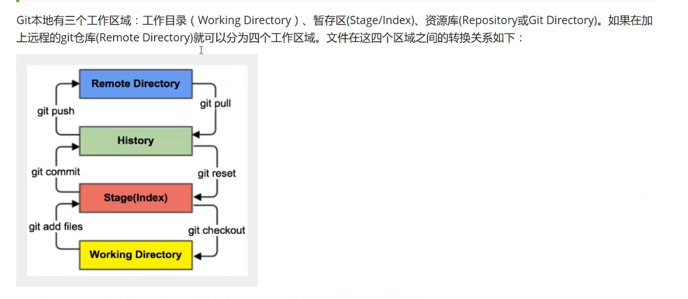
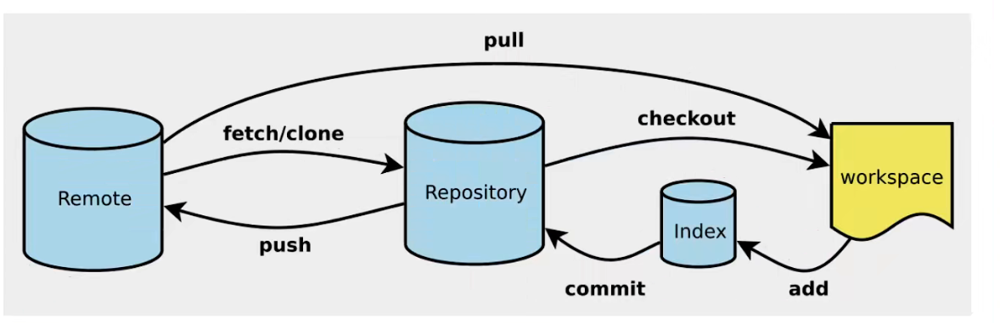

## 1 版本控制

> 版本迭代

# 2 Git环境配置

git config --global user.name "chenhengfei"

git config --global user.name "821132332@qq.com"

# 3.git基本理论



# 4 git项目搭建



本地

git init

克隆

```git
git clone https://gitee.com/kuangstudy/kuang_livenote.git
```


# 5 git文件操作

```bash
#查看状态
git status
#将未跟踪文件跟踪
git add .
#将跟踪文件提交至本地仓库
git commit -m “注释消息内容”

```

> gitignore 忽略文件

```bash
*.txt			#忽略所有.txt结尾的文件
/temp			#忽略项目根目录下的TODO文件,不包括其他目录
build/			#忽略build/目录下的所有文件
```

# 6 使用Gitee

1.注册

2.设置本机绑定SSH公钥,实现免密码登录

```bash
# 进入c:\user\adminstrator\.ssh目录
# 生成公钥 用一些加密算法
ssh-keygen -t rsa
```

3.将公钥信息public key添加到Gitee账户

4.使用Gitee创建自己的仓库

## 7 IDEA中集成项目

1.新建项目绑定git

​	将远程git文件目录拷贝到项目中即可

2.修改文件,使用IDEA操作git

​	添加到暂存区

​	commit提交

​	push到远程仓库

3.提交测试

# 8 git分支

```bash
#新建一个分支
git branch [branch-name]

#新建一个分支并切换
git check -b [branch]

#合并指定分支到当前分支
git merge [branch]

#删除分支
git branch -d [branch-name]

#删除远程分支
git push origin --delete [branch-name]
git branch -dr [remote/branch]
```

多个分支如果并行执行,就会导致代码不冲突,同时存在多个版本


