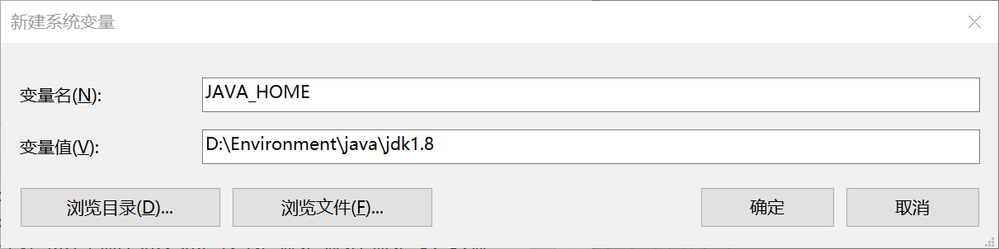

JDK:Java Development Kit

JRE:Java Runtime Environment

JVM:JAVA Virtual Machine

## 卸载jdk

1.删除java安装目录

2.删除java_home

3.删除path下关于java的目录

4.java -version

## 安装jdk

1.记住安装路径

2.配置环境变量

​	1.电脑->属性

​	2.环境变量



​	3.配置path变量

```
%JAVA_HOME%\bin
%JAVA_HOME%\jre\bin
```

​	4.Java-version验证

3.验证

```java
public class Hello{
	public static void main(String[] args){
		System.out.print("Hello World!");
	}
}
```

编译javac Hello.java 生成Hello.class文件

运行java Hello 

# 1 Java基础语法

## 1 注释

平时注意写代码的规范，写注释。

```java
public class HelloWorld {
    public static void main(String[] args) {
        //注释，输出Hello,World!
        System.out.println("Hello,World!");
    }
    //多行注释
        /*
         多行注释
         多行注释
         多行注释
         */

        //JavaDoc:文档注释
        /**
         * @Description HelloWorld
         * @Author  陈恒飞，开源
         */
}
```

## 2 标识符

类名、变量名以及方法名都被称为标识符

### 关键字

abstract、case、if、const等等

### 标识符注意点 

> 标识符应该以字母，美元符$,或下划线开始
>
> 不能是关键字作为变量名或方法名
>
> 标识符大小写敏感

## 3 数据类型


强类型语言：所有变量必须先定义后使用

基本类型：byte\short\int\long\float\double\char\boolean

引用类型：类、接口、数组

## 4 类型转换

```java
int a = (byte)16;

```

## 5 变量

```java
public class Demo08 {
    //属性：变量

    //类变量 static
    static double salary = 2500;

    //实例变量：从属于对象，如果不自行初始化，这个类型的默认值
    //除了基本类型，其余的默认值都是null；
    String name;
    int age;

    //main方法
    public static void main(String[] args) {
        //局部变量：必须声明和初始化值
        int i = 10;
        System.out.println(i);
        System.out.println("====================================");
        //变量类型 变量名字 = new Demo08();
        Demo08 demo08 = new Demo08();
        System.out.println(demo08.age);
        System.out.println(demo08.name);

        //类变量 static
        System.out.print  ln(salary);
    }

    //其他方法
    public void add(){
    }
}
```


## 6 运算符

算术运算符、赋值运算符、关系运算符、逻辑运算符、位运算符、条件运算符、扩展赋值运算符

## 7 包机制

为了更改的组织类，Java提供了宝鸡至，用于区别类名的命名空间

```java
//语法格式
package pkg1[. pkg2[. pkg3...]];
//一般利用公司域名倒置作为包名

import package1[.package2...].(classname|*);
```

## 8 JavaDoc

用来生成自己的API文档

```java
javadoc -encoding UTF-8 -charset UTF-8 Doc.java
```

# 2 Java流程控制

## 1 用户交互Scanner

**scanner对象**

```java
//基本语法
Scanner s = new Scanner(System.in);
```

通过Scanner类的next()与nextLine()方法获取输入的字符串，再读取前我们一般需要使用hasNext()与hasNextLine()判断是否还有输入的数据。

> next（）
>
> 1.一定要读取到有效字符后才可以结束输入
>
> 2.对输入有效字符之前遇到的空白，next()方式会自动将其去掉。
>
> 3.只有输入有效字符后才将其后面输入的空白作为分隔符或者结束符
>
> 4.next()不能得到带有空格的字符串

> nextLine()
>
> 1.以Enter作为结束符，nextLine()方法返回的是输入回车之前的所有字符
>
> 2.可以获得空白

## 2 顺序结构

## 3 选择机构

## 4 循环结构

```java
//for循环
//增强for循环
```

```java
public class EnhanceForDemo01 {
    public static void main(String[] args) {
        int[] numbers = {10,20,30,40,50};

        for (int i = 0; i < 5; i++) {
            System.out.println(numbers[i]);
        }

//        for(int x:numbers){
//            System.out.println(x);
//        }
    }
}
```


## 5 break & continue

> break用于强行停止循环，不执行循环中剩余的语句。

> continue语句用在循环语句体中，用于终止某次循环过程，即跳过循环体中尚未执行的语句，记者进行下一次是否执行循环的判定。

## 6 Practice

```java
public class TestDemo {
    public static void main(String[] args) {
        //打印三角形
        for (int i = 1; i <= 5; i++) {
            for (int j = 5; j >= i; j--) {
                System.out.print(" ");
            }
            for (int j = 1; j <= i; j++) {
                System.out.print("*");
            }
            for (int j = 1; j < i; j++) {
                System.out.print("*");
            }
            System.out.println();
        }
    }
}
```

# 3 Java方法详解

## 1 方法是什么

方法是语句的集合，在一起执行一个功能。

> 方法的命名规则：首字母小写，驼峰命名规则
>
> 一个方法只完成一个功能，便于后期扩展


## 2 方法的定义

**扩展：值传递（Java）和引用传递**

## 3 方法重载

重载：在一个类中，有相同的函数名称，但形参不同的函数。

> 规则：
>
> 1.名称必须相同
>
> 2.参数列表不同
>
> 3.方法返回类型可以相同也可以不同
>
> 4.仅仅返回类型不同不足以成为方法的重载

```java
public class Demo01 {
    public static void main(String[] args) {
        int sum = add(1,2);
        double sum1 = add(1.0,2.0);
        System.out.println(sum);

    }

    //添加static使这个方法成为类变量
    public static int add(int a, int b){
        return a+b;
    }
    public static double add(double a, double b){
        return a+b;
    }
}
```

 

## 4 命令行传参

希望运行一个程序时候再传递给它消息，靠传递命令行参数给main函数实现 

## 5 可变参数

Java支持传递同类型的可变参数给一个方法

再方法生命中，再指定参数类型后加一个省略后（...）

一个方法中只能指定一个可变参数，它必须是方法的最后一个参数，普通参数只能再前面声明

## 6 递归

> 递归包含两个部分
>
> 递归头：什么时候不调用自身方法。如果没有头，将陷入死循环。
>
> 递归体：什么时候需要调用自身方法。

```java
public class Demo06 {
    //阶乘
    public static void main(String[] args) {
        System.out.println(f(3));

    }

    public static int f(int n) {
        if (n == 1) {
            return 1;
        }else{
            return n*f(n-1);
        }
    }

}
```

# 4 数组

## 1 数组概述

相同类型数据的有序集合；

四个特点：1.长度确定	2.相同类型	3.可以是任何类型，基本&引用类型	4.数组变量属引用类型，也可看做对象

## 2 数组声明

先声明，后使用。

```java
dataType[] arrayRefVar;	
dataType   arrayRefVar[];
//使用new操作符来创建数组
dataType[] arrayRefVar = new dataType[arraySize];
```

### 1 内存分析

内存：堆、栈、方法区

堆：存放new的对象和数组，可以被所有的线程共享，不会存放别的对象引用

栈：存放基本变量类型（会包含这个基本类型的具体数值），引用对象的变量（会存放这个引用在堆里边的具体地址）

方法区：可以被所有线程共享。包含了所有的class和static变量


## 3 数组使用

```java
package com.chen.arrays;

public class ArrayDemo04 {
    public static void main(String[] args) {
        int[] arrays = {1,2,3,4,5};
        //增强型for循环
//        for (int array : arrays) {
//            System.out.println(array);
//        }
        printArray(arrays);
        System.out.println();
        //不加static的话就需要先new一个对象
        ArrayDemo04 arrayDemo04 = new ArrayDemo04();
        int[] reverse = arrayDemo04.reverse(arrays);
        printArray(reverse);
    }
	//加static的目的是为了方便直接调用
    //打印数组元素
    public static void printArray(int[] array){
        for (int i = 0; i < array.length; i++) {
            System.out.print(array[i]+" ");
        }
    }
	//不加static的话就需要new AyyayDemo04();如main函数中所示
    //反转数组，数组作为返回值
    public int[] reverse(int[] arrays){
        int[] result = new int[arrays.length];

        for (int i = 0,j = result.length-1; i < arrays.length; i++,j--) {
            result[j] = arrays[i];
        }
        return result;
    }
}

```

### 1 静态初始化

### 2 动态初始化

数组的默认初始化：数组是引用类型，它的元素相当于类的实例变量，因此数组一经分配空间，其中的每个元素也被按照实例变量同样的方式被**隐式初始化**。

```java
public class Man {

}
//数组对象本身是在堆中的
//数组变量属于引用类型，数组可以看成是对象，数组中的每个元素相当于该对象的成员变量
public class ArrayDemo02 {
    public static void main(String[] args) {
        //静态初始化
        int[] a = {1,23,3};
		System.out.println(a[0]);
        //引用类型
        Man[] mans = {new Man(),new Man()};

        //动态初始化
        int[] b = new int[10]; 
        b[0] = 10;
        System.out.println(b[2]);
    }
}
```

### 3 数组边界

[0,length-1]，越界就会便错ArrayIndexOutofBoundsException

## 4 多维数组

```java
package com.chen.arrays;

public class ArrayDemo05 {
    public static void main(String[] args) {
        //[4][2]
        int[][] array = {{1,2},{2,3},{3,4},{4,5}};
//        System.out.println(array[0]);
        printArray(array[0]);
        System.out.println();

        for (int i = 0; i < array.length; i++) {
            for (int j = 0; j < array[i].length; j++) {
                System.out.println(array[i][j]);
            }
        }
    }

    public static void printArray(int[] array){
        for (int i = 0; i < array.length; i++) {
            System.out.print(array[i]+" ");
        }
    }
}

```

## 5 Arrays类

数组的工具类java.util,Arrays

### 1 冒泡排序

```java
import java.util.Arrays;

public class ArrayDemo07 {
    public static void main(String[] args) {
        int[] a = {1,231,443,12,45,23,2};
        int[] sort = sort(a);
        System.out.println(Arrays.toString(sort));
    }
    //冒泡排序
    //1.比较数组中，两个相邻的元素，如果第一个数比第二个数大，就交换他们的位置
    //2.每一次比较，都会产生出一个最大的数，或者最小的数字
    //3.下一轮则可以少一次刨析
    //4.一次循环吗,知道结束
    public static int[] sort(int[] array){
        int temp = 0;
        //外层循环，判断要走多少次循环
        for (int i = 0; i < array.length-1; i++) {
            boolean flag = false;//通过标识位减少比较次数;
            //内层循环，比较判断两个数，如果第一个数大就交换位置;
            for (int j = 0; j < array.length-1-i; j++) {
                if (array[j+1] < array[j]){
                    temp = array[j];
                    array[j] = array[j+1];
                    array[j+1] = temp;
                    flag = true;
                }
            }
            if (flag == false){
                break;
            }
        }
        return array;
    }
}
```


## 6 稀疏数组

```java
public class ArrayDemo08 {
    public static void main(String[] args) {
        //1.创建一个二维数组11*11       0：无棋子  1：黑棋    2：白棋
        int[][] array1 = new int[11][11];
        array1[1][2] = 1;
        array1[2][3] = 2;
        System.out.println("输出原始数组");
        //输出原始数组
        //增强型循环：for Each循环
        for (int[] ints : array1) {
            for (int anInt : ints) {
                System.out.print(anInt+"\t");
            }
            System.out.println();
        }
        System.out.println("========================");

        //转换为稀疏数组保存
        //获取有效值的个数
        int sum = 0;
        for (int i = 0; i < 11; i++) {
            for (int j = 0; j < 11; j++) {
                if (array1[i][j] != 0){
                    sum++;
                }
            }
        }
        System.out.println("有效值个数："+sum);

        //2.创建一个稀疏数组的数组
        int[][] array2 = new int[sum+1][3];
        array2[0][0] = 11;
        array2[0][1] = 11;
        array2[0][2] = sum;

        //遍历二维数组，将非零的值，存放稀疏数组中
        int count = 0;
        for (int i = 0; i < array1.length; i++) {
            for (int j = 0; j < array1.length; j++) {
                if (array1[i][j] != 0){
                    count++;
                    array2[count][0] = i;
                    array2[count][1] = j;
                    array2[count][2] = array1[i][j];
                }
            }
        }

        //3.输出稀疏数组
        System.out.println("稀疏数组");

        for (int i = 0; i < array2.length; i++) {
            System.out.println(array2[i][0]+"\t"
                              +array2[i][1]+"\t"
                              +array2[i][2]+"\t");
        }
    }
}

```

# 5 面向对象

## 1 面向对象

对于描述复杂的事物，为了从宏观上把握、从整体上合理分析，需要使用面向对象的思路来分析整个系统。但是，具体到围观操作，仍需要面向过程的思路去处理。 

面向对象编程的本质：**以类的方式组织代码，以对象的组织（封装）数据**

> 三大特性：封装、继承、多态

## 2 方法回顾加深

### 1 方法的定义

修饰符，返回类型，break，方法名，参数列表，异常抛出

### 2 方法的调用：递归

静态、非静态方法，形参和实参，值传递和引用传递，this关键字

```java
//值传递
//值传递
public class Demo04 {
    public static void main(String[] args) {
        int a = 1;
        System.out.println(a);//1

        Demo04.change(a);
        System.out.println(a);//1
    }

    public static void change(int a){
        a = 10;
    } 
}
```

```java
//引用传递
//引用传递:对象，本质还是值传递
public class Demo05 {
    public static void main(String[] args) {
        Person person = new Person();
        System.out.println(person.name);//null

        Demo05.change(person);
        System.out.println(person.name);
    }
    public static void change(Person person){
        //person是一个对象，指向的是 Person person = new Person();
        //这是一个具体的人可以改变
        person.name = "CHF";
    }
}

class Person{
    String name;
}
```


## 3 对象的创建分析

### 1 构造器

> 构造器：
>
> 1.和类名相同
>
> 2.没有返回值
>
> 作用：
>
> 1.new本质在调用构造方法
>
> 2.初始化对象的值
>
> 注意点：
>
> 1.定义有参构造之后，如果想使用无参构造，显式的定义一个无参构造
>
> 快捷键：
>
> alt+inset

```java
public class Person {
    //即使一个类什么都不写，也会存在一个构造器（方法）
    //显式定义构造器
    String name;

    //实例化初始值
    //1.使用new关键字，必须要有构造器
    //2.用来初始化值
    public Person(){
        this.name = "陈";
    }

    //有参构造:一旦有了有参构造，无参构造必须显式定义
    public Person(String name){
        this.name = name;
    }
}
```

```java

public class Application {
    public static void main(String[] args) {
        //类是抽象的，需要实例化
        //类实例化后会返回一个自己的对象
        //student对象就是一个Student类的具体实例
//        Student xiaoming = new Student();
//        xiaoming.name = "小明";
//        xiaoming.age = 3;
//
//        System.out.println(xiaoming.name);
//        System.out.println(xiaoming.age);
        Person person = new Person("chenhengfei");

        System.out.println(pers on.name);

    }
}
```

### 2 内存分析

创建对象的内存分析

```java
//mian函数
package com.oop;

import com.oop.demo03.Pet;

public class Application {
    public static void main(String[] args) {
        Pet dog = new Pet();
        dog.name = "旺财";
        dog.age = 3;
        dog.shout();

        System.out.println(dog.name);
        System.out.println(dog.age);

        Pet cat = new Pet();
    }
}

```

```java
//Pet类
public class Pet {
    public String name;
    public int age;

    public Pet() {
    }

    public void shout(){
        System.out.println( "叫了一声");
    }
}
```


### 3 类与对象小结

> 1.类与对象：类是一个模板：抽象，对象是一个具体实例
>
> 2.方法：定义、调用
>
> 3.对应的引用：引用类型：基本类型（8）
>
> ​	对象是通过引用来操作的：栈---->堆
>
> 4.属性：字段Field 成员变量	默认初始化：数字（0，0.0），char（u0000），Boolean（false），引用null
>
> 修饰符 属性类型 属性名 = 属性值
>
> 5.对象的创建与使用
>
> ​	-必须是使用new关键字创建对象，构造器 Person chen = new Person();
>
> ​	-对象的属性	chen.name
>
> ​	-对象的方法	chen.sleep(); 
>
> 6.类：静态的属性，动态的行为，（属性，方法）

## 4 面向对象三大特性

封装、继承、多态

### 1 封装

> 面向对象的本质：以类的方式组织代码，以对象的组织（封装）数据

> 封装：数据的隐藏，通常应禁止直接访问一个对象中数据的实际表示，而应通过操作接口来访问。
>
> 属性私有：get/set

```java
/*
    1.提高程序的安全性，保护数据
    2.隐藏代码的实现细节
    3.统一接口
    4.系统可维护性增加
 */
public class Student {
    private String  name;
    private int id;
    private char sex;

    //提供一些可以操作这些私有属性的方法
    //提供一些public的get/set方法
    public String getName(){
        return this.name;
    }

    public void setName(String name){
        this.name = name;
    }
}


public class Application {
    public static void main(String[] args) {
        Student s1 = new Student();
        s1.setName("陈恒飞");
        System.out.println(s1.getName());;
    }
}
```

### 2 继承

extends继承，子类是父类的扩展，子类继承了父类就会拥有父类的全部方法。

Java中只有单继承，没有多继承。

#### 1 Object类

```java
//Java中所有的类都默认直接或简介继承object类
```

#### 2 Super类

 super注意点：

> 1.super调用父类的构造方法，必须在构造方法的第一个
>
> 2.super必须只能出现在子类的方法或构造方法中
>
> 3.super和this不能同时调用构造方法

VS this：

> 代表的对象不同：
>
> ​	this：本身调用者这个对象
>
> ​	super：代表父类对象的应用
>
> 前提
>
> ​	this：没有继承也可以使用
>
> ​	super：只能在继承条件才可以调用
>
> 构造方法
>
> ​	this()；本类的构造
>
> ​	super()；父类的构造

```java
package com.oop;
import com.oop.demo05.Student;
/*
    1.提高程序的安全性，保护数据
    2.隐藏到吗的实现细节
    3.统一接口
    4.系统可维护性增加
 */
public class Application {
    public static void main(String[] args) {
        Student student = new Student();
        //student.test("111");
        //student.test1();
    }
}

package com.oop.demo05;
public class Person {
//Java中所有的类都默认直接或简介继承object类
    protected String name = "chenhengfei";

    public Person() {
        System.out.println("Person无参构造执行");
    }

    public void print(){
        System.out.println("Person");
    }
}

package com.oop.demo05;
public class Student extends Person{
    private String name = "陈恒飞";

    public Student() {
        //隐藏代码：调用了父类的无参构造
        //super();
        System.out.println("Student无参构造执行");
    }

    public void print(){
        System.out.println("Student");
    }

    public void test1(String name){
        print();
        this.print();
        super.print();
    }

    public void test1(){
        print();
        this.print();
        super.print();
    } 

    public void test(String name){
        System.out.println(name);
        System.out.println(this.name);
        System.out.println(super.name);
    }
}

```

#### 3 方法重写

重写都是方法的重写和属性无关

总结：

> 需要有继承关系，子类重写父类的方法！
>
> 1.方法名必须相同
>
> 2.参数列表必须相同
>
> 3.修饰符：范围可以扩大：private->Default->protected->public
>
> 4.抛出的异常：范围，可以被缩小，但不能扩大：Exception（大）-->ClassNotFoundException

重写，子类的方法和父类必要一致

> 为什么要重写：
>
> 1.父类的功能，子类不一定需要，或者不一定满足

```java
package com.oop.demo05;
public class A extends B {
    //Override重写
    @Override
    public void test() {
        System.out.println("A=>test()");
    }
}

package com.oop.demo05;
public class B {
    public void test(){
        System.out.println("B=>test()");
    }
}

package com.oop;
import com.oop.demo05.A;
import com.oop.demo05.B;
//静态方法和非静态方法有很大区别
//非静态：重写
public class Application {
    public static void main(String[] args) {
        //方法的的调用只和左边，
        //定义的数据类型有关
        A a = new A();
        a.test();

        //父类的引用指向了子类
        B b = new A();//子类重写了父类的方法
        b.test();
    }
}
```

### 3 多态

同一种方法可以根据发送对象的不同而采用多种不同的行为方式

多态注意事项：

> 1.多态是方法的多态，属性没有多态
>
> 2.父类和子类，有联系  类型转换异常 ClassCastException
>
> 3.多态存在的条件：继承关系，方法需要重写，父类引用指向子类对象 Father f1 = new Son()；
>
> ​	①static 方法，属于类，不属于实例
>
> ​	②final   常量
>
> ​	③pricate方法

```java
public class Application {
    public static void main(String[] args) {
        //一个对象的实际类型是确定的
        //可以指向的引用类型就不确定了
        //Student能调用的方法都是自己的或者继承父类的
        Student s1 = new Student();
        //父类的引用指向子类的类型
        //Person父类型，可以指向子类，但是不能调用子类独有的方法
        Person s2 = new Student();
        Object s3 = new Student();
        //s2.eat();
        s2.run();//子类重写了父类的方法
        s1.eat();
    }
}

public class Person {
    public void run(){
        System.out.println("run");
    }
}

public class Student extends Person {
    @Override
    public void run() {
        System.out.println("son");
    }

    public void eat(){
        System.out.println("eat");
    }
}
```

```java
public class Application {
    public static void main(String[] args) {
        //类型之间的转化：父 子
        //高                 低
        Person obj = new Student();

        //student将这个对象转换为Student类型，我们就可以使用Student类型的方法
        Student student = (Student) obj;
        student.go();
        //((Student) obj).go();

        //子类转换为父类，可能会丢失自己一些方法
    }
}


public class Person {
    public void run(){
        System.out.println("run");
    }
}

public class Student extends Person {
    public void go(){
        System.out.println("go");
    }

}
```

### 4 static

```java
public class Student {
    private static int age;//静态的遍历  多线程！
    private double score;//非静态变量
    


    public static void main(String[] args) {
        Student s1 = new Student();

        System.out.println(Student.age);
        //System.out.println(Student.score);

        System.out.println(s1.age);
        System.out.println(s1.score);
    }
}
```

```java
package com.oop.demo07;

public class Person {

    //2.赋初值
    {
        //代码块（匿名代码块）
        System.out.println("匿名代码块");
    }

    //1.只执行一次
    static {
        //静态代码块
        System.out.println("静态代码块");
    }

    public Person(){
        System.out.println("构造方法");
    }

    //3
    public static void main(String[] args) {
        Person person1 = new Person();
        System.out.println("====================");
        Person person2 = new Person();

    }
}

```

## 5 抽象类和接口

### 1 抽象类

```java
//abstract抽象类
//类 extends：单继承
//接口可以多继承
public abstract class Action {
    //约束
    //抽象方法，只有方法名字，没有方法的实现
    public abstract void doSomething();

    //1.不能new这个抽象类，只能靠子类去实现它：约束
    //2.抽象类中可以写普通的方法
    //3.抽象方法必须在抽象类中
    //抽象的抽象：约束
}


//抽象类的所有方法，继承了它的子类，都必须要实现它的方法
public class A extends Action {
    @Override
    public void doSomething() {

    }
}
```

### 2 接口

> 作用：
>
> ​	1.约束
>
> ​	2.定义一些方法啊，让不同的人实现
>
> ​	3.public abstract
>
> ​	4.public static final
>
> ​	5.接口不能被实例化
>
> ​	6.implements可以实现多个接口
>
> ​	7.必须重写接口中的方法

只有规范！自己无法写方法~专业的约束

约束和实现分离：面向接口编程 

```java
//接口类就是抽象类，只定义了方法名没有实现它，需要方法重写
public interface UserService {
    //接口中的所有定义其实都是抽象的public abstract
    void add(String name);
    void delete(String name);
    void update(String name);
    void query(String name);
}

public interface TimeService {
    void timer();
}

//类可以实现接口 implements 接口
//实现了接口中的类，就需要重写接口中的方法
//接口可以实现多继承
public class UserServiceImpl implements UserService,TimeService{
    @Override
    public void add(String name) {

    }

    @Override
    public void delete(String name) {

    }

    @Override
    public void update(String name) {

    }

    @Override
    public void query(String name) {

    }

    @Override
    public void timer() {

    }
}


```

## 6 内部类及OOP实战

### 1 成员内部类

### 2 静态内部类

### 3 局部内部类

### 4 匿名内部类

```java
package com.oop;

import com.oop.demo10.Outer;

public class Application {
    public static void main(String[] args) {
        Outer outer = new Outer();
        Outer.Inner inner = outer.new Inner();
        inner.in();
    }
}


package com.oop.demo10;

public class Outer {
    private int id = 10;
    public void out(){
        System.out.println("这是外部类的方法");
    }

    public class Inner{
        public void in(){
            System.out.println("这是内部类的方法");
        }
        public void getID(){
            System.out.println(id);
        }
    }
}

```

### 

# 6 异常  

## 1 异常

Exception

异常指程序再运行中出现的不期而至的各种状况，如文件找不到、网络连接失败、非法参数等，影响正常的程序执行流程。

```java
//StackOverflowError
public class Demo01 {
    public static void main(String[] args) {
        new Demo01().a();
    }

    public void a(){
        b();
    }

    public void b(){
        a();
    }
}
```

## 2 异常体系结构

> Java把异常当作对象来处理，并定义一个基类java.lang.throwable作为所有异常的超类
>
> 在Java API中已经定义了许多异常类，这些异常分为两大类，错误Error和Exception

## 3 Java异常处理机制

Error和Exception的区别：Error通常是灾难性的致命错误，程序无法控制和处理，当出现这些异常时，Java虚拟机一般会选择终止线程；Exception通常情况下是可以被程序处理的，并且在程序中应该尽可能处理这些异常

## 4 处理异常

> 异常处理的五个关键字
>
> try、catch、finally、throw、throws

```java
public class Test {
    public static void main(String[] args) {
        int a = 1;
        int b = 0;

        //假设要捕获多个异常：从小到大
        try {//try监控区域
            if(b==0){//主动抛出异常throw  throws
                throw new ArithmeticException();
            }
            System.out.println(a/b);

        }catch (Error e){//catch();参数，想要捕获的异常类型
            System.out.println("程序出现异常，变量b不能为0");
        }catch (Exception e){
            System.out.println("Exception");
        }catch (Throwable e){
            System.out.println("Throwable");
        }finally {//处理善后工作
            System.out.println("finally");
        }
        //finally 可以不要finally，假设IO，资源，关闭
    }
}
```

```java
public class Test {
    public static void main(String[] args) {
        int a = 1;
        int b = 0;

        new Test().test(1,0);
        //finally 可以不要finally，假设IO，资源，关闭
    }

    public void test(int a,int b){
        if(b==0){//主动抛出异常throw  throws
            throw new ArithmeticException();//主动抛出异常，一般在方法中使用
        }
        System.out.println(a/b);
    }
}
```

```java
package com.exception;

public class Test {
    public static void main(String[] args) {
        int a = 1;
        int b = 0;

        try {
            new Test().test(1,0);
        } catch (ArithmeticException e) {
            e.printStackTrace();
        }
        //finally 可以不要finally，假设IO，资源，关闭
    }

    //假设这个方法中处理不了这个异常，在方法上抛出异常
    public void test(int a,int b) throws ArithmeticException{
        if(b==0){//主动抛出异常throw  throws
            throw new ArithmeticException();//主动抛出异常，一般在方法中使用
        }
        System.out.println(a/b);
    }
}
```

## 5 自定义异常

> 1.创建自定义异常类
>
> 2.在方法中通过throw关键字抛出异常对象
>
> 3.如果在当前抛出异常的方法中处理异常，可以使用try-catch语句捕获并处理；否则在方法的声明处通过throws关键字指明要抛出给方法调用者的异常，继续进行下一次操作
>
> 4.在出现异常方法的调用者中捕获并处理异常

```java
package com.exception.demo02;

public class Test {
    //可能会存在异常的方法
    static void test(int a) throws MyException {
        System.out.println("传递的参数为：" + a);
        if (a>10){
            throw new MyException(a);
        }
        System.out.println("OK");
    }
	//自定义接收异常
    public static void main(String[] args) {
        try {
            test(11);
        } catch (MyException e) {
            System.out.println("MyException=>" + e);
        }
    }
}


package com.exception.demo02;

//自定义的异常类
public class MyException extends Exception{
    //传递数字 > 10
    private int detail;

    public MyException(int a) {
        this.detail = a;
    }

    /* toString : 异常的打印信息*/

    @Override
    public String toString() {
        return "MyException{" + detail + '}';
    }
}
```

## 6 总结

**常用类、集合、IO**

# 7 常用类

String的常用方法：length、charAt、equals、startWith、indexOf、getBytes

## 1 字符串相关的类

### 1 String的特性

string是一个final类，代表不可变。

```java
public class StringTest {
    /*
    String的使用：
        1.String声明为final的，不可被继承
        2.String实现了Serializalbe接口，表示字符是支持序列化的
                实现了Comparable接口：表示String可以比较大小
        3.String内部定义了final char[] value 用于存储字符串数据
        4.String代表不可变的字符序列，简称不可变性
            体现：1.当对字符串重新赋值时，重新指定内存区域，不能使用原有的Value进行赋值
            	 2.当对现有的字符串进行连接操作时，也需要重新指定内存区域赋值，不能使用原有的value进行赋值。
        5.通过字面量的方式给一个字符串赋值，此时的字符串值声明在字符串常量池中
        6.字符串常量池冲不会存储相同内容的字符串
     */
    @Test
    public void test1(){
        String s1 = "abc";
        String s2 = "abc";
//        s1 = "hello";
        System.out.println(s1 == s2);//比较s1和s2的地址值
        System.out.println(s1);
        System.out.println(s2);

    }
}
```

```java
package com.commonclass.demo01;

import org.junit.Test;
import org.junit.validator.PublicClassValidator;

public class Demo02 {
    @Test
    public void test3(){
        String s1 = "javaEE";
        String s2 = "hadoop";

        String s3 = "javaEEhadoop";
        String s4 = "javaEE" + "hadoop";
        String s5 = s1 + "hadoop";
        String s6 = "javaEE" + s2;
        String s7 = s1 + s2;
        // “==”判断地址，“equals判断字符串”
        System.out.println(s3 == s4);//true
        System.out.println(s3 == s5);//false
        System.out.println(s3 == s6);//false
        System.out.println(s3 == s7);//false
        System.out.println(s6 == s7);//false
        System.out.println(s5 == s6);//false

        String s8 = s5.intern();//返回值得到的s8使用的常量值已经存在的“javaEEhadoop”
        System.out.println(s3 == s8);//true
    }
//    String str1 = "abc";
//    String str2 = new String("abc");
//    两者的区别
    /*
    String的实例化方式
    方式一：通过字面量定义的方式
    方式二：通过new+构造器的方式
     */
    @Test
    public void test2(){
        //此时的s1和s2的数据声明在方法区中的字符串常量池中
        String s1 = "javaEE";
        String s2 = "javaEE";
        //通过new+构造器的方式，此时s3和s4保存的地址值，是数据在堆空间中开辟
        //以后对应的地址值
        String s3 = new String("javaEE");
        String s4 = new String("javaEE");

        System.out.println(s1 == s2);
        System.out.println(s1 == s3);
        System.out.println(s1 == s4);
        System.out.println(s3 == s4);
        System.out.println("==================================");
        Person p1 = new Person("Tom",12);
        Person p2 = new Person("Tom",12);
        System.out.println(p1.name.equals(p2.name));

        System.out.println(p1.name == p2.name);

        p1.name = "Jerry";
        System.out.println(p2.name);
        System.out.println(p1.name == p2.name);
    }
}
```

### 2 常用String类

```java
package com.commonclass.demo01;

import org.junit.Test;

public class StringTest {
    /*
    String的使用：
        1.String声明为final的，不可被继承
        2.String实现了Serializalbe接口，表示字符是支持序列化的
                实现了Comparable接口：表示String可以比较大小
        3.String内部定义了final char[] value 用于存储字符串数据
        4.String代表不可变的字符序列，简称不可变性
            体现：

     */
    @Test
    public void test1(){
        String s1 = "abc";
        String s2 = "abc";
//        s1 = "hello";
        System.out.println(s1 == s2);//比较s1和s2的地址值
        System.out.println(s1);
        System.out.println(s2);

        String s4 = "abc";
        String s5 = s4.replace('a','m');
        System.out.println(s5);
        System.out.println(s4);

        System.out.println("======================================");
        String str = "hello|world|java";
        String[] strs = str.split("\\|");
        for (int i = 0; i < strs.length; i++) {
            System.out.println(strs[i]);
        }
        System.out.println();

        String str2 = "hello.world.java";
        //字符串数组
        String[] strs2 = str2.split("\\.");
        for (int i = 0; i < strs.length; i++) {
            System.out.println(strs[i]);
        }
    }
}


package com.commonclass.stringmethodtest;

import org.junit.Test;

public class StringMethodTest {
    /*
    int length();
    char charAt(int index);
    boolean is Empty();
    String toLowerCase();
    String toUpperCase();
    String trim();
    boolean equals(Object obj);
    ...
     */

    @Test
    public void test(){
        String s1 = "helloworld";
        String s5 = "Helloworld";
        System.out.println(s1.equals(s5));
        System.out.println(s1.equalsIgnoreCase(s5));
        System.out.println("=========");
        System.out.println(s1.charAt(1));

        System.out.println(s1.isEmpty());
        String s2 = s1.toUpperCase();
        System.out.println(s2);

        String s3 = "   he llo  world";
        String s4 = s3.trim();//去除首尾空格

        System.out.println(s3);
        System.out.println(s4);

        String s22 = "abc";
        String s33 = s22.concat("def");
        System.out.println(s33);

        String s6 = "abc";
        String s7 = new String("aba");
        System.out.println(s6.compareTo(s7));//涉及到字符串排序
    }
    /*boolean endsWith(String suffix);测试字符串是否以指定的后缀结束
      boolean startWith(String prefix);
      boolean startWith(String prefix, int toffset);
      boolean contains(CharSequence s);
      */

    @Test
    public void test2(){
        String str1 = "helloworld";
        boolean b1 = str1.endsWith("ld");
        System.out.println(b1);

        boolean b2 = str1.startsWith("h");
        System.out.println(b2);

        boolean b3 = str1.startsWith("e",1);
        System.out.println(b3);

        String str2 = "wor";
        System.out.println(str1.contains(str2));

    }

    @Test
    public void test3(){
        String str1 = "陈恒飞";
        String str2 = str1.replace('飞','走');
        System.out.println(str2);

        String tel = "0379-8888888";
        boolean result = tel.matches("0379-\\d{7,12}");
        System.out.println(result);

        //String[] split(String regex);根据给定正则表达式
    }
}
```

3 String和基本类型、包装类之间的转换

```java
public class StringTest1 {
    /*
    String与基本类型、包装类之间的转换
    String--->基本类型、包装类:调用包装类的静态方法：paraseXxx(str)
    基本类型、包装类---->String
     */
    @Test
    public void test1(){
        String str1 = "123";
        //错误的写法
        //int num = (int)str1;
        int num = Integer.parseInt(str1);//123

        String str2 = String.valueOf(num);//"123"
        String str3 = num + "";
        System.out.println(str1==str3);
        System.out.println(str3);
    }
    @Test
    //char和String之间的转换：调用tocharArray（）
    //String--->char调用构造器
    public void test2(){
        String str1 = "abc123";
        char[] charArray = str1.toCharArray();
        for (int i = 0; i < charArray.length; i++) {
            System.out.println(charArray[i]);
        }

        char[] arr = new char[]{'h','e','l','l','o'};
        String str2 = new String(arr);
        System.out.println(str2);
    }
}
```

#### 1 String、StringBuffer和StringBuilder的异同？

```java
public class StringTest4 {
//    String、StringBuffer和StringBuilder的异同？
//    String：不可变的字符序列,底层使用char[]存储
//    StringBuffer：可变的字符序列,线程安全,效率低,底层使用char[]存储
//    StringBuilder：可变的字符序列,线程不安全,效率高,底层使用char[]存储
    /*
    String str = new String();//new char[0];
    String str1 = new String("abc");//new char[]{'a','b','c'};

    StringBuffer sb1 = new StringBuffer();//new char[16];底层创建了一个长度为16的数组
    System.out.println(sb1.length());
    sb1.append('a');//value[0] = 'a';
    sb1.append('b');//value[1] = 'a';

    StringBuffer sb2 = new StringBuffer("abc");//char[] vlaue = new char["abc".length() + 16]

    //Q1:System.out.println(sb2.length());//3
    //Q2:扩容问题：如果添加的数据底层数组盛不了，需要扩容数组

     */
    @Test
    public void test1(){
        StringBuffer sb1 = new StringBuffer("abc");
        sb1.setCharAt(0,'m');
        System.out.println(sb1);

        StringBuffer sb2 = new StringBuffer();//new char[16];底层创建了一个长度为16的数组
        System.out.println(sb2.length());
    }
}
```

#### 2 StringBuffer

```java
public class StringBufferTest {
//    StringBuffer的常用方法：
//    增：append，删：delete，改：repalce/setCharAt，查：charAt，
//    反转：reverse...
//    插：insert(int offset,xxx)
//    indexof，substring，length，charAt，setCharAt
//    遍历：for+charAt()
    @Test
    public void test1(){
        StringBuffer s1 = new StringBuffer("abc");
        s1.append(1);
        System.out.println(s1);
        s1.delete(0,1);
        System.out.println(s1);
        s1.replace(0,2,"...");
        System.out.println(s1);
        s1.reverse();
        System.out.println(s1);
    }
}
```

## 2 JDK8中之前、之后 日期时间API

```
public class DataTimeTest {
    /*
        java.util.Date类
                |---java.sql.Date类
        1.两个构造器的使用

        2.两个方法的使用
            >toString():显示当前时间
            >getTime():获取当前时间对应的毫秒数

        3.java.sql.Date对应数据库中日期类型的变量
            >如何实例化
            >sql.Date ----> util.Date
            >java.util.Date----> java.sql.Date
     */
    @Test
    public void test(){

//      构造器1：Date(),创建一个对应当前时间的Date对象
        Date date1 = new Date(); 
        System.out.println(date1.toString());

        System.out.println(date1.getTime());

//      构造器2：创建指定毫秒数的Date对象
        Date date2 = new Date(1633938306672L);
        System.out.println(date2.toString());

//      创建java.sql.Date对象
        java.sql.Date date3 = new java.sql.Date(1633938306672L);
        System.out.println(date3);
        System.out.println("========================");

//      java.util.Date----> java.sql.Date
//      情况1：
        Date date4 = new java.sql.Date(1633938306672L);
        java.sql.Date date5 = (java.sql.Date) date4;
//      情况2：
        Date date6 = new Date();
        java.sql.Date date7 = new java.sql.Date(date6.getTime());
        System.out.println(date7.toString());
    }
}
```

### 1 SimpleDateFormat类

```java
public class DateTimeTest {
    /*
        JDK8之前的日期时间的API测试
        1.System类中currentTimeMills();
        2.java.util.Date和子类java.sql.Date
        3.SimpleDateFormat
        4.Calendar

        SimpleDateFormat：SimpleDateFormat对日期Date类的格式化解析
        1.两个操作：
        1.1 格式化：日期--->字符串
        1.2 解析：格式化的逆过程，字符串--->日期

        2.SimpleDateFormat的实例化

     */
    @Test
    public void testSimpleDateFormat() throws ParseException {
        //实例化SimpleDateFormat:使用默认的构造器
        SimpleDateFormat sdf = new SimpleDateFormat();
        //格式化：日期--->字符串
        Date date = new Date();
        System.out.println(date);

        String format = sdf.format(date);
        System.out.println(format);

        //解析：格式化逆过程
        String str = format;
        Date date1 = sdf.parse(str);
        System.out.println(date1);


        SimpleDateFormat sdf1 = new SimpleDateFormat("yyyy-MM-dd hh:mm:ss");
        String format1 = sdf1.format(date);
        System.out.println(format1);

        Date date2 = sdf1.parse("2021-10-11 08:56:35");
        System.out.println(date2);
    }
```

```java
/*
        java.util.Date类
                |---java.sql.Date类
        1.两个构造器的使用

        2.两个方法的使用
            >toString():显示当前时间
            >getTime():获取当前时间对应的毫秒数

        3.java.sql.Date对应数据库中日期类型的变量
            >如何实例化
            >sql.Date ----> util.Date
            >java.util.Date----> java.sql.Date
     */
    @Test
    public void test(){

//      构造器1：Date(),创建一个对应当前时间的Date对象
        Date date1 = new Date();
        System.out.println(date1.toString());

        System.out.println(date1.getTime());

//      构造器2：创建指定毫秒数的Date对象
        Date date2 = new Date(1633938306672L);
        System.out.println(date2.toString());

//      创建java.sql.Date对象
        java.sql.Date date3 = new java.sql.Date(1633938306672L);
        System.out.println(date3);
        System.out.println("========================");

//      java.util.Date----> java.sql.Date
//      情况1：
        Date date4 = new java.sql.Date(1633938306672L);
        java.sql.Date date5 = (java.sql.Date) date4;
//      情况2：
        Date date6 = new Date();
        java.sql.Date date7 = new java.sql.Date(date6.getTime());
        System.out.println(date7.toString());
    }
}
```

### 2 Calendar 日历类的使用

```java
public class CalendarClass {
//    Calendar类的使用
    @Test
    public void testCalendar(){
        //1.实例化
        //方式1：创建子类GregorianCalendar的对象
        //方式2：调用静态方法getInstance（）
        Calendar calendar = Calendar.getInstance();
        System.out.println(calendar.getClass());

        //2.常用方法
        //get()\set()\add()\getTime()\setTime
        //get
        int days = calendar.get(Calendar.DAY_OF_MONTH);
        System.out.println(days);
        System.out.println(calendar.get(Calendar.DAY_OF_YEAR));
        //set
        calendar.set(Calendar.DAY_OF_MONTH,12);
        days = calendar.get(Calendar.DAY_OF_MONTH);
        System.out.println(days);
        //add()
        calendar.add(Calendar.DAY_OF_MONTH,3);
        days = calendar.get(Calendar.DAY_OF_MONTH);
        System.out.println(days);

        //getTime():日历类--->Date
        Date date = calendar.getTime();
        System.out.println(date);
        //SimpleDateFormat,利用SimpleDateFormat实例化转换时间格式
        SimpleDateFormat sdf = new SimpleDateFormat();
        String format = sdf.format(date);
        System.out.println(format);

        //setTime();Date--->日历类
        Date date1 = new Date();
        calendar.setTime(date1);
        days = calendar.get(Calendar.DAY_OF_MONTH);
        System.out.println(days);
    }
}
```

### 3 JDK8中新日期时间API

#### 1 LocalDate、LocalTime、LocalDateTime的使用

```java
public class JDK8DateTimeTest {
    //JDK8中的日期时间测试
    @Test
    public void testDate(){
        Date date1 = new Date(2021,9,8);
        System.out.println(date1);

        SimpleDateFormat sdf = new SimpleDateFormat();
        String format = sdf.format(date1);
        System.out.println(format);
    }

    /*
        LocalDate\LocalTime\LocalDateTime的使用
     */
    @Test
    public void test1(){
        LocalDate localDate = LocalDate.now();
        LocalTime localTime = LocalTime.now();
        LocalDateTime localDateTime = LocalDateTime.now();
        System.out.println(localDate);
        System.out.println(localTime);
        System.out.println(localDateTime);

        //of()设置指定的年月日没有偏移量
        LocalDateTime localDateTime1 = localDateTime.of(2020, 10, 6, 12, 12, 12);
        System.out.println(localDateTime1);

        //getXxx()
        System.out.println(localDateTime.getDayOfMonth());
        System.out.println(localDateTime.getDayOfWeek());
        System.out.println(localDateTime.getDayOfYear());

        //withXxx()
        //体现local的不可变性
        LocalDate localDate1 = localDate.withDayOfMonth(22);
        System.out.println(localDate);
        System.out.println(localDate1);

        LocalDateTime localDateTime2 = localDateTime.withHour(4);
        System.out.println(localDateTime);
        System.out.println(localDateTime2);
    }
}
```

#### 2 Instant

```java
public class InstantClass {
    //Instant
    @Test
    public void test1(){
        //本初子午线的时间
        Instant instant = Instant.now();
        System.out.println(instant);
        //子午线+8小时 = 东八区时间
        OffsetDateTime offsetDateTime = instant.atOffset(ZoneOffset.ofHours(8));
        System.out.println(offsetDateTime);

        long l = instant.toEpochMilli();
        System.out.println(l);
    }
    
    //DateTimeFormatter:类似于SimpleDateFormat，格式化或解析日期、时间
    @Test
    public void test3(){
        DateTimeFormatter formatter = DateTimeFormatter.ISO_LOCAL_DATE_TIME;
        //格式化：日期-->字符串
        LocalDateTime localDateTime = LocalDateTime.now();
        String format = formatter.format(localDateTime);
        System.out.println(localDateTime);
        System.out.println(format);

        //解析：字符串--->日期
        TemporalAccessor parse = formatter.parse("2021-10-12T15:12:39.521");
        System.out.println(parse);

    }
}
```

## 3 Java比较器

```java
public class Compare {
    /*
        1.说明：Java中的对象，正常情况下，只能进行比较：== 或 ！=。不能使用 > 或 <的
        但是在开发场景中，需要对多个对象进行排序，所以就需要比较对象的大小
        如何实现？使用两个接口中的任何一个：Comparable或Comparator
        2.Comparable接口的使用的使用举例
            ①：像String、包装类等实现了Comparable接口，重写了compareTo()方法以后，进行了从小到大的排列。
            给出了比较两个对象大小的方式
            ②：重写compareTo(obj)的规则：如果当前对象this大于形参对象obj，则返回正整数
            如果当前对象this小于形参对象obj，则返回负整数，如果当前对象this等于形参对象
            obj，则返回零。
     */
    @Test
    public void test1(){
        String[] arr = {"AA", "BB", "EE", "DD", "AA"};
        Arrays.sort(arr);
        System.out.println(Arrays.toString(arr));
    }
}
```

## 4 System类

void exit(int status);

void gc()：请求系统进行垃圾回收

## 5 Math类


## 6 BigInteger与BigDecimal


