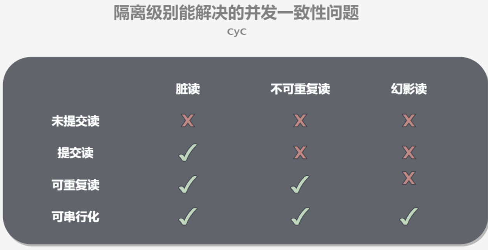

# 1 Mysql

数据库xxx语言 CRUD 增删改查

DDL 定义

DML 操作

DQL 查询

DCL 控制

# 2 操作数据库

操作数据库->操作数据库中的表->操作数据库中表的数据

## 2.1 操作数据库

1 创建数据库

```sql
CREATE DATABASE westos;
```

```sql
CREATE DATABASE xxx CHARACTER SET utf8 COLLATE utf8_general_ci
```


2 删除数据库

```sql
DROP DATABASE westos
```

3 使用数据库

```sql
SHOW DATABASES;-- 查看所有的数据库
```

## 2.2 数据库的列类型

**数值**

> tinyint		十分小的数据		1个字节
>
> smallint	较小的数据			2个字节
>
> midumint	中等大小的数据	3个字节
>
> **int			标准的整数			4个字节**
>
> big		较大的数据				8个字节
>
> float 	浮点数						4个字节
>
> double	浮点数					8个字节(精度问题)
>
> decimal	字符串形式的浮点数	金融计算时候,一般使用decimal

**字符串**

>char		字符串固定大小 0-255
>
>**varchar	可变字符串	0-65535	常用的String**
>
>tinytext	微型文本	2^8-1
>
>text	文本串		2^16 -1
>
>

时间日期

> java.util.Date
>
> date 	YYYY-MM-DD,日期
>
> time	HH:mm:ss	时间格式
>
> **datetime	YYYY-MM-DD HH:mm:ss 最常用的时间格式**
>
> **timestamp	时间戳,1970.1.1到现在的毫秒数**
>
> year	年份表示

**null**

> 没有值 未知
>
> 不要使用null进行运算,结果为null

## 2.3 数据库的字段属性

unsigned:

> 无符号整数

zerofill

> 0填充的
>
> 不足的位数,使用0来填充

自增:

> 自动在上一条记录的基础上+1(默认)
>
> 通常用来设计唯一的逐渐~index,必须是整数类型
>
> 可以自定义设计主键的起始值和不唱

非空:

> null  not null
>
> 假设设置为not null,如果不给它赋值就会报错
>
> null 如果不填写值 默认是null

默认:

> 设置默认的值
>
> sex,默认值为男,如果不指定该列的值,则会由m有默认的值

## 2.4 创建数据库表

```sql
CREATE TABLE IF NOT EXISTS `student` (
	`id` INT(4) NOT NULL AUTO_INCREMENT COMMENT '学号',
	`name` VARCHAR(30) NOT NULL DEFAULT '匿名' COMMENT '姓名',
	`pwd` VARCHAR(20) NOT NULL DEFAULT '123456' COMMENT '密码',
	`sex` VARCHAR(2) NOT NULL DEFAULT '女' COMMENT '性别',
	`birthday` DATETIME DEFAULT NULL COMMENT '出生日期',
	`address` VARCHAR(100) DEFAULT NULL COMMENT '家庭住址',
	`Email` VARCHAR(50) DEFAULT NULL COMMENT '邮箱',
	PRIMARY KEY (`id`)
)ENGINE=INNODB DEFAULT CHARSET=utf8 
```

格式

```sql
CREATE TABLE [IF NOT EXISTS] `表名`(
    '字段名' 列类型 [属性] [索引] [注释],
    ...
    '字段名' 列类型 [属性] [索引] [注释],
    '字段名' 列类型 [属性] [索引] [注释]
)[表类型] [字符集设置] [注释]
```

常用命令

```sql
SHOW CREATE DATABASE `school`
SHOW CREATE TABLE student

DESC student
```

## 2.5 数据表类型

```sql
-- 关于数据库引擎
/*
INNODB 默认使用
MYISAM 早年使用
*/
```

|            | MYISAM | INNODB       |
| ---------- | ------ | ------------ |
| 事务支持   | 不支持 | 支持         |
| 数据行锁定 | 不支持 | 支持         |
| 外键约束   | 不支持 | 支持         |
| 全文索引   | 支持   | 不支持       |
| 表空间大小 | 较小   | 较大,约为2倍 |

常规使用操作:

> MYISAM	节约空间,速度较快
>
> INNODB	安全性高,多表多用户操作

> 在物理空间存在的位置

所有数据库文件都在data目录下,一个文件夹对应一个数据库

本质还是文件的存储

MySQL引擎在物理文件上的区别

> InnoDB在数据库表中只有一个*.frm文件,以及上级目录下的ibdata1文件
>
> MYISAM对应文件:*.frm 表结构的定义文件
>
> ​							*.MYD数据文件
>
> ​							*.MYI索引文件

> 设置数据库字符集编码
>
> ```
> charset=utf8
> ```
>
> 在my.ini中配置默认的编码

## 2.6 修改删除表

> 修改

```sql
-- 修改表名 ALTER TABLE 旧表名 RENAME AS 新表名
ALTER TABLE teacher RENAME AS teacher1

-- 增加表的字段 ALTER TABLE 表名 ADD 字段名 列属性
ALTER TABLE teacher1 ADD age INT(11) 

-- 修改表的字段(重命名,修改约束)
-- modify用来修改字段类型和约束	change用来字段重命名
ALTER TABLE teacher1 MODIFY age VARCHAR(10)
ALTER TABLE teacher1 CHANGE age age1 INT(1)

-- 删除表的字段
ALTER TABLE teacher1 DROP age1

```

> 删除

```sql
-- 删除表的字段
ALTER TABLE teacher1 DROP age1
-- 删除表
DROP TABLE IF EXISTS teacher1
```

**注意:**

`` 字段名用这个包裹

注释--

sql 关键字大小不敏感,建议小写

# 3 MySQL数据管理

## 3.1 外键

> **方式一**  在创建表的时候 增加约束(麻烦,复杂)
>
> ```sql
> CREATE TABLE `grade`(
> 	`gradeid` INT(10) NOT NULL AUTO_INCREMENT COMMENT '年纪id',
> 	`gradename` VARCHAR(50) NOT NULL COMMENT '年纪名称',
> 	PRIMARY KEY(`gradeid`)
> )ENGINE=INNODB CHARSET=utf8
> 
> -- 学生表的gradeid字段 要去引用年纪表的gradeid
> -- 定义外键key
> -- 给这个外键添加约束(执行引用)
> CREATE TABLE IF NOT EXISTS `student` (
> 	`id` INT(4) NOT NULL AUTO_INCREMENT COMMENT '学号',
> 	`name` VARCHAR(30) NOT NULL DEFAULT '匿名' COMMENT '姓名',
> 	`pwd` VARCHAR(20) NOT NULL DEFAULT '123456' COMMENT '密码',
> 	`sex` VARCHAR(2) NOT NULL DEFAULT '女' COMMENT '性别',
> 	`birthday` DATETIME DEFAULT NULL COMMENT '出生日期',
> 	`gradeid` INT(10) NOT NULL COMMENT '学生年纪',
> 	`address` VARCHAR(100) DEFAULT NULL COMMENT '家庭住址',
> 	`Email` VARCHAR(50) DEFAULT NULL COMMENT '邮箱',
> 	PRIMARY KEY (`id`),
> 	KEY `FY_gradeid` (`gradeid`),
> 	CONSTRAINT `FY_gradeid` FOREIGN KEY (`gradeid`) REFERENCES `grade`(`gradeid`)
> )ENGINE=INNODB DEFAULT CHARSET=utf8 
> 
> ```
>
> 方式二:
>
> ```sql
> CREATE TABLE `grade`(
> 	`gradeid` INT(10) NOT NULL AUTO_INCREMENT COMMENT '年纪id',
> 	`gradename` VARCHAR(50) NOT NULL COMMENT '年纪名称',
> 	PRIMARY KEY(`gradeid`)
> )ENGINE=INNODB CHARSET=utf8
> 
> -- 学生表的gradeid字段 要去引用年纪表的gradeid
> -- 定义外键key
> -- 给这个外键添加约束(执行引用)
> CREATE TABLE IF NOT EXISTS `student` (
> 	`id` INT(4) NOT NULL AUTO_INCREMENT COMMENT '学号',
> 	`name` VARCHAR(30) NOT NULL DEFAULT '匿名' COMMENT '姓名',
> 	`pwd` VARCHAR(20) NOT NULL DEFAULT '123456' COMMENT '密码',
> 	`sex` VARCHAR(2) NOT NULL DEFAULT '女' COMMENT '性别',
> 	`birthday` DATETIME DEFAULT NULL COMMENT '出生日期',
> 	`gradeid` INT(10) NOT NULL COMMENT '学生年纪',
> 	`address` VARCHAR(100) DEFAULT NULL COMMENT '家庭住址',
> 	`Email` VARCHAR(50) DEFAULT NULL COMMENT '邮箱',
> 	PRIMARY KEY (`id`)
> )ENGINE=INNODB DEFAULT CHARSET=utf8 
> 
> -- 创建表的时候没有外键关系
> ALTER TABLE `student`
> ADD CONSTRAINT `FK_gradeid` FOREIGN KEY(`gradeid`) REFERENCES `grade` (`gradeid`);
> 
> ```
>
> 以上两种方式不建议使用,避免使用数据库过多造成困扰

> **最佳**
>
> **数据库就是单纯的表,只用来存数据**
>
> **想使用多张表,想使用外键,用程序是实现**

## 3.2 DML语言(全部记住)

数据库的意义:数据存储,数据管理

DML:数据操作语言

insert

update

delete

## 3.3 添加 INSERT

```sql
-- 插入数据
-- insert into 表名([字段名1,字段2,字段3]) values('值1'),('值2'),('值3',...)
-- 由于主键自增我们可以省略(如果不写表的字段,他们就会一一匹配)
INSERT INTO `grade`(gradename) VALUES('大四')
-- 插入多个字段
INSERT INTO grade(gradename) VALUES('大二'),('大一')


INSERT INTO `student`(`name`) VALUES ('张三')
INSERT INTO `student`(`name`,`pwd`,`sex`) VALUES ('李四','aaaa','男')

```

注意事项:

> 1.字段和字段之间使用英文逗号隔开
>
> 2.字段可以省略,但是后面的值必须要一一对应

条件 where 子句 运算符 id 等于某个值,大于某个值,在某个区间内修改

| 操作符           | 含义          | 范围 | 结果  |
| ---------------- | ------------- | ---- | ----- |
| =                | 等于          | 5=6  | false |
| <> 或 !=         | 不等于        | 5<>6 | true  |
| >                |               |      |       |
| <                |               |      |       |
| >=               |               |      |       |
| between...and... | 闭合区间[2,5] |      |       |
| AND              |               |      |       |
| OR               |               |      |       |


## 3.4 修改UPDATE

```sql
UPDATE `student` SET `name`='ceshi' WHERE `name`='asdasd' AND sex='男'
```

value也可以是一个变量

## 3.5 删除DELETE

```sql
-- 删除数据(避免这样写)
-- delete from 表名 [where 条件]
DELETE FROM `student` WHERE id=1;

-- TRUNCATE 完全情况一个数据库表,表的节后和索引约束不会变
-- 清空student表
TRUNCATE `student`

-- delete和truncate区别
-- 相同点 都能删除数据,都不会删除表结构
-- truncate 重新设置 自增列 计数器会归零
-- truncate 不会影响事务

-- 测试delete和truncate的区别
CREATE TABLE `test`(
	`id` INT(4) NOT NULL AUTO_INCREMENT,
	`coll` VARCHAR(20) NOT NULL,
	PRIMARY KEY (`id`)
)ENGINE=INNODB DEFAULT CHARSET=utf8

INSERT INTO `test`(`coll`) VALUES('1'),('2'),('3')
DELETE FROM test -- 不会影响自增
INSERT INTO `test`(`coll`) VALUES('1'),('2'),('3')

TRUNCATE TABLE test
```

了解:delete删除的问题,重启数据库现象

> INNODB 自增列会从1开始(存在内存中,断电即失)
>
> MYISAM 继续从上一个自增量开始(存在文件中,不会丢失)

# 4 DQL语言

## 4.1 DQL

 数据查询语言

所有的查询操作它都能做~

数据库中最核心的语言

> SELECT语法

```sql
SELECT [ALL | DISTINCT]
{* |table.* | [table.field1[as alias1][,table.field2[as alias2]][,...]]}
FROM table_name [as table_alias]
	[left | right | inner join table_name2]	-- 联合查询
	[WHERE ...]	-- 指定结果需满足的条件
	[GROUP BY ...] -- 指定结果按照哪几个字段来分组
	[HAVING]	-- 过滤分组的记录必须满足的次要条件
	[ORDER BY ...]	-- 指定查询记录按一个或多个条件排序
	[LIMIT {[offset,]row_count | row_countOFFSET offset}];	-- 指定查询的记录从哪条至哪条	
```


## 4.2 指定查询字段

```sql
-- 查询全部学生	
SELECT * FROM student

-- 查询指定字段
SELECT `studentno`,`studentname` FROM student
 
-- 别名,给结果起一个新名字
SELECT studentno AS '学号',studentname AS '姓名' FROM student 
 
 -- CONCAT(a,b)
SELECT CONCAT('姓名：', `studentname`) AS 新名字 FROM student

```

> 有时候，列名字不是那么的见名知意

```sql

SELECT * FROM result

SELECT `studentno` FROM result
-- 去除select查询出来的结果,重复的数据只显示一条

SELECT DISTINCT `studentno` FROM result
```

> 数据库的列

```sql
-- ******** 数据库的列表达式
-- 查询版本
SELECT VERSION()

SELECT 100*3-1 AS 计算结果

-- 查询自增的步长
SELECT @@auto_increment_increment

-- 学院考试成绩+1分查看
SELECT `studentno`,studentresult+1 AS '提分后' FROM result

```

数据库中的表达式：文本值，列，null，函数，计算表达式，系统变量

```sql
select [表达式] from 表
```

## 4.3 where条件子句

作用：检索数据中**符合条件**的值

```sql
-- =======================where=========================
SELECT studentno,studentresult FROM result
-- 95-100分之间
SELECT studentno,studentresult FROM result 
WHERE studentresult>=95 AND studentresult<=100

-- between and
SELECT studentno,studentresult FROM result 
WHERE studentresult BETWEEN 95 AND 100
-- 除1000号学生之外的同学的成绩
SELECT studentno,studentresult FROM result
WHERE studentno=1000;


```


> 模糊查询:比较运算符

| 运算符      | 语法               | 描述                                           |
| ----------- | ------------------ | ---------------------------------------------- |
| IS NULL     | a IS NULL          | 操作符为NULL，结果为真                         |
| IS NOT NULL | a IS NOT NULL      | 操作符不为NULL，结果为真                       |
| BETWEEN     | A BETWEEN B AND C  | 若a在b和c之间，则结果为真                      |
| **LIKE**    | A LIKE B           | SQL匹配，如果a匹配b，则结果为真                |
| **IN**      | A IN (A1,A2,A3...) | 假设a在a1，或者a2...其中的某一个值中，结果为真 |


```sql
-- =================模糊查询=====================
-- 查询姓刘的同学
-- like结合	%(代表0到任意个字符)	_(一个字符)
SELECT studentno,studentname FROM student
WHERE studentname LIKE '张%'

-- 查询姓后只有一个字的
SELECT studentno,studentname FROM student
WHERE studentname LIKE '张_'

-- 查询姓后有两个字的
SELECT studentno,studentname FROM student
WHERE studentname LIKE '张__'

-- 查询名字中间有某个字的
SELECT studentno,studentname FROM student
WHERE studentname LIKE '%张%'

-- ================in(具体的一个或多个值)==============
-- 查询指定的学生
SELECT studentno,studentname FROM student
WHERE studentno IN (1001,1002,1003);

-- 查询在北京的学生
SELECT `studentno`,studentname FROM student
WHERE address IN ('河南洛阳');

-- =======null not null===========
-- 查询地址为空的学生
SELECT `studentno`,studentname FROM student
WHERE address='' OR address IS NULL;

-- 查询有出生日期的同学
SELECT `studentno`,studentname FROM student
WHERE borndate IS NOT NULL;
```

## 4.4 联表查询


```SQL
/*
1.分析需求
2.确定使用哪种链接查询? 7种
确定交叉点(这两个表中哪个数据是相同的)
判断条件:学生表中 studentno = 成绩表 studentno
*/
-- ============INNER JOIN================
SELECT s.studentno, studentname,subjectno,studentresult
FROM student AS s
INNER JOIN result AS r
ON s.studentno=r.studentno

-- ============RIGHT JOIN================
SELECT s.studentno, studentname,subjectno,studentresult
FROM student AS s
RIGHT JOIN result AS r
ON s.studentno=r.studentno

-- ============LEFT JOIN================
SELECT s.studentno, studentname,subjectno,studentresult
FROM student AS s
LEFT JOIN result AS r
ON s.studentno=r.studentno
```

|    操作    | 描述                                       |
| :--------: | :----------------------------------------- |
| INNER JOIN | 如果表中至少有一个匹配，就返回行           |
| LEFT JOIN  | 会从左表种返回所有的值，即使右表中没有匹配 |
| RIGHT JOIN | 会从右表种返回所有的值，即使左表中没有匹配 |

```sql
-- ===========查询多张表==============
SELECT s.studentno, studentname,subjectname,studentresult
FROM student AS s
RIGHT JOIN result AS r
ON r.studentno=s.studentno
INNER JOIN `subject` AS sub
ON r.subjectno=sub.subjectno

-- 我要查询哪些数据 select
-- 从哪几个表中查from表 
-- xxx join 连接的表 
-- on 交叉条件
-- 假设存在一种多张表查询,慢慢来,先查询两张表然后再慢慢增加

```

> 自连接

自己的表和自己的表连接，核心：一张表拆为两张一样的表即可

操作：

```sql

-- 查询父子信息:把一张表堪为两个一模一样的表
SELECT a.`categoryName` AS '父栏目',b.`categoryName` AS '子栏目'
FROM `category` AS a, `category` AS b
WHERE a.`categoryid`=b.`pid`

```

## 4.5 分页和排序

> 语法

```sql
-- =============分页limit和排序order by===================
-- 排序：升序 ASC 降序DESC

-- 分页
-- 缓解数据库压力,体验好,瀑布流


-- 分页,每页只显示五条数据
-- 语法:limit 当前页,页面的大小

-- 第一页 limit 0,5
-- 第二页 limit 5,5
-- 第三页 limit 10,5
-- 第n页  limit (n-1)*pageSize,pageSize

```

```sql
-- 查询Java第一学年课程成绩排名前十的学生,并且分数要大于80的学生信息(学号,姓名,课程名称,分数)
SELECT s.`studentno`,`studentname`,`subjectname`,`studentresult`
FROM `student` s
INNER JOIN `result` r
ON s.studentno=r.studentno
INNER JOIN `subject` sub
ON sub.`subjectno`=r.`subjectno`
WHERE subjectname='Java程序设计-1' AND studentresult>=80
ORDER BY studentresult DESC
LIMIT 0,10

```

## 4.6 子查询

where（这个值是计算出来的）

本质：在where语句中嵌套一个子查询语句

where（select * from）

```sql
-- ===============where===============
-- 1.查询数据库-1的所有考试结果(学号,科目,成绩)降序排列
-- 方式一:连接查询
SELECT `studentno`,`subjectname`,`studentresult`
FROM `result` r
INNER JOIN `subject` sub
ON r.subjectno=sub.subjectno
WHERE `subjectname`='高等数学-1'
ORDER BY studentresult DESC

-- 方式二:使用子查询(由里及外)
SELECT `studentno`,`subjectno`,`studentresult`
FROM `result`
WHERE studentno = (
	SELECT subjectno FROM `subject`
	WHERE `subjectname`='高等数学-1' 
)
ORDER BY studentresult DESC

-- 查询所有数据结构-1的学生学号
SELECT subjectno FROM `subject`
WHERE `subjectname`='数据库结构-1' 

-- 分数不小于80分的学生学号和姓名
SELECT DISTINCT s.`studentno`,`studentname`
FROM student s
INNER JOIN result r
ON r.studentno=s.studentno
-- 在这个基础上增加一个科目,高等数学-2
WHERE studentresult >= 80 AND `subjectno`=(
	SELECT subjectno FROM `subject` 
	WHERE `subjectname` = '高等数学-2'
)

-- 查询课程为高等数学-2且分数不小于80的同学的学号和姓名
SELECT s.`studentno`,`studentname`,`subjectname`
FROM student s
INNER JOIN result r
ON s.studentno=r.studentno
INNER JOIN `subject` sub
ON sub.`subjectno`=r.`subjectno`
WHERE `subjectname` = '高等数学-2' AND studentresult >= 80

```

## 4.7 分组及过滤

```sql
SELECT [ALL | DISTINCT]
{* |table.* | [table.field1[as alias1][,table.field2[as alias2]][,...]]}
FROM table_name [as table_alias]
	[left | right | inner join table_name2]	-- 联合查询
	[WHERE ...]	-- 指定结果需满足的条件
	[GROUP BY ...] -- 指定结果按照哪几个字段来分组
	[HAVING]	-- 过滤分组的记录必须满足的次要条件
	[ORDER BY ...]	-- 指定查询记录按一个或多个条件排序
	[LIMIT {[offset,]row_count | row_countOFFSET offset}];	-- 指定查询的记录从哪条至哪条	
```


```sql
-- 查询不同课程的平均分,最高分,最低分
-- 核心:(根据不同的课程分组)
SELECT subjectname,AVG(studentresult) AS 平均分,MAX(studentresult),MIN(studentresult)
FROM result r
INNER JOIN `subject` sub
ON r.`subjectno`=sub.`subjectno`
GROUP BY r.subjectno	-- 通过什么字段进行分组
HAVING 平均分>80


```


# 5 MySQL函数

## 5.1 常用函数

```sql
-- =======================常用函数===================
-- 数学运算
SELECT ABS(-8)
SELECT CEILING(9.4) -- 向上取整
SELECT FLOOR(9.4)   -- 向下取整
SELECT RAND()	    -- 返回一个0~1之间的随机数
SELECT SIGN(-1)	    -- 判断一个数的符号

-- 字符串函数
SELECT CHAR_LENGTH('啊实打实打算')	-- 字符串长度
SELECT INSERT()
SELECT LOWER()
SELECT UPPER()
SELECT REPLACE()
SELECT SUBSTR()
SELECT SUBSTRING()
SELECT REVERSE()

-- 查询姓周的同学
SELECT REPLACE(studentname,'周','zuu') FROM student
WHERE studentname LIKE '周%'

-- 时间和日期函数(记住)
SELECT CURRENT_DATE()	-- 获取当前日期
SELECT CURDATE()	-- 获取当前日期
SELECT NOW()		-- 获取当前时间
SELECT LOCALTIME()	-- 获取本地时间

-- 系统
SELECT USER()
SELECT VERSION()
```

## 5.2 聚合函数(常用)

| 函数名称 | 描述   |
| -------- | ------ |
| COUNT()  | 计数   |
| SUM()    | 求和   |
| AVG()    | 平均值 |
| MAX()    | 最大值 |
| MIN()    | 最小值 |

## 5.3 数据库级别的MD5加密算法

主要增强算法复杂度和不可逆性

MD5不可逆，具体的值的md5是一样的。

```sql
-- =========测试MD5 加密==========

CREATE TABLE `testmd5`(
	`id` INT(4) NOT NULL,
	`name` VARCHAR(20) NOT NULL,
	`pwd` VARCHAR(50) NOT NULL,
	 PRIMARY KEY(`id`)
)ENGINE = INNODB DEFAULT CHARSET=utf8

INSERT INTO testmd5 VALUES 
(1,'zhangsan','123456'),
(2,'lisi','123456'),
(3,'wangwu','123456'),
(4,'asdasd','123456'),
(5,'affgf','123456')

-- 加密
UPDATE testmd5 SET pwd=MD5(pwd)		-- 加密全部的密码
-- where id=1

-- 插入的时候加密
INSERT INTO testmd5 VALUES 
(10,'xiaoming',MD5('123456'))


ALTER TABLE testmd5 MODIFY `id` INT(4) AUTO_INCREMENT

-- 如何校验:将用户传递进来的密码,进行md5加密,然后比较加密后的值
SELECT * FROM testmd5 WHERE `name`='xiaoming' AND pwd=MD5('123456');
```

# 6 事务

## 6.1 什么是事务

要么都成功，要么都失败

---------

1.sql执行 A给B转账

2.sql执行 B收到A的钱

---------------

将一组SQL放在一个批次中去执行

> **事务原则：ADID原则  原子性，一致性，隔离性，持久性**

原子性（atomicity）：要么都成功，要不都失败

一致性（consistency）：针对一个事务操作前后的状态一致

持久性（isolation）：事务结束后的数据不随着外界原因导致数据丢失（一旦提交不可逆。没有提交，恢复到原装；提交，持久化到数据库）

隔离性（durability）：针对多个用户同时操作，排除其他事务对本次事务的影响


```sql
-- ==================事务==================
-- mysql默认开启事务,自动提交
SET autocommit = 0  -- 关闭
SET autocommit = 1  -- 开启(默认)

-- 手动处理事务
SET autocommit = 0  -- 关闭自动提交
-- 事务开启
START TRANSACTION	-- 标记一个事务的开始,从这个之后的sql都在同一个事务之内
INSERT xx
INSERT xx

-- 提交:持久化(成功)
COMMIT
-- 回滚(失败)
ROLLBACK

-- 事务结束
SET autocommit = 1  -- 开启自动提交

-- 了解
SAVEPOINT -- 保存点名称 设置一个事务的保存点
ROLLBACK TO SAVEPOINT -- 回滚到保存点
RELEASE SAVEPOINT  -- 撤销保存点

```

> 模拟场景

```sql
-- ======================模拟场景=================
CREATE DATABASE shop CHARACTER SET utf8 COLLATE utf8_general_ci
USE shop

CREATE TABLE `account`(
	`id` INT(3) NOT NULL AUTO_INCREMENT,
	`name` VARCHAR(30) NOT NULL,
	`money` DECIMAL(9,2) NOT NULL,
	PRIMARY KEY(`id`)
)ENGINE=INNODB DEFAULT CHARSET=utf8

INSERT INTO account(`name`,`money`)
VALUES('A',2000.00),('B',1000.00)

-- 模拟转账(一组事务)
SET autocommit = 0;	-- 关闭自动提交
START TRANSACTION	-- 开启一个事务
UPDATE account SET money=money-500 WHERE `name`='A'; 	-- A减500
UPDATE account SET money=money+500 WHERE `name`='B';	-- B加500

COMMIT;
ROLLBACK;

SET autocommit = 1;	-- 恢复默认值
```

## 6.2 封锁

解决事务并发不一致问题，通过并发控制保证隔离性。并发控制可以通过封锁实现。

> **mysql两种封锁粒度:行级锁和表锁**

尽量只锁定需要修改数据的那部分,而不是所有资源.锁定的数据越少,发生锁争用的可能性越小,系统并发程度越高.

## 6.3 封锁类型

1.读写锁

* **互斥锁,X锁,写锁**
* **共享锁,S锁,读锁**
  * 规定1:一个事务对数据对象A加了X锁,可以对A进行读取和更新,其他事务不能对A加任何锁.
  * 规定2:一个事务对数据对象A加了S锁,可以对A进行读取操作,但是不能进行更新操作.加锁期间其他事务可以对A加S锁,但是不能加X锁.

2.意向锁

## 6.4 封锁协议

* 三级封锁协议

  * 一级封锁协议

    > 可以解决丢失修改问题

    事务T要修改数据A时必须加X锁,知道T结束才释放锁.可以

  * 二级封锁协议

    > 可以解决脏读的问题

    在一级基础上,要求读取数据A时必须加S锁,读取完马上释放S锁

  * 三级封锁协议

    > 解决不可重复读问题,读取数据A时,其他事务不能对A加X锁,从而避免在读的期间数据发生改变

    在二级基础上,要求读取数据A时必须加S锁,知道事务结束才能释放S锁

## 6.5 隔离级别

* 未提交读 READ UNCOMMITTED

  事务中的修改,即使没有提交,其他事务也可见.

* 提交读

  一个事务只能读取提交的事务所做的修改.即事务提交之前对其他事务不可见.

* 可重复读

  保证同一事务中多次读取同一数据结果一样.

* 可串行化

  强制事务串行执行，这样多个事务互不干扰，不会出现并发一致性问题。

  该隔离级别需要加锁实现，因为要使用加锁机制保证同一时间只有一个事务执行，也就是保证事务串行执行。

  

# 7 索引

**索引（index）帮助MySQL高效获取数据的数据结构**

提取句子主干，就可以得到索引的本质：索引是数据结构

## 7.1 索引的分类

**在一个表中,主键索引只能有一个,唯一索引可以有多个**

> 主键索引(primary key)
>
> ​	> 唯一标识,主键不可重复,只能有一个列作为主键
>
> 唯一索引(unique key)
>
> ​	> 避免重复出现,唯一索引可以重复,多个列都可以标识为唯一索引
>
> 常规索引(key/index)
>
> ​	> 默认的,index key关键字来设置
>
> 全文索引(fulltext)
>
> ​	> 在特定的数据库引擎下才有,MYISAM
>
> ​	> 快速定位数据


```sql
-- 索引的使用
-- 在创建表的时候给字段增加索引
-- 创建完毕后 增加索引
SHOW INDEX FROM student

-- 增加一个索引
ALTER TABLE school.`student` ADD FULLTEXT INDEX `studentname`(`studentname`);

-- explain 分析sql执行的状况
EXPLAIN SELECT * FROM student; -- 非全文索引

EXPLAIN SELECT * FROM student WHERE MATCH(studentname) AGAINST('周');
```

## 7.2 测试索引

索引在小数据量的时候，用处不大，但是在大数据时候，区别十分明显。

## 7.3 索引原则

> 索引不是越多越好
>
> 不要对经常变动的数据加索引
>
> 小数据量的表不需要加索引
>
> 索引一般加在常用来查询的字段上

**索引的数据结构（看）**

Hash类型的索引

Btree：INNODB的默认数据结构


# 8 权限管理和备份

## 8.1 用户管理

SQLyog可视化管理


SQL命令操作:用户表mysql.user

本质：对这张表进行增删改查

```sql

-- ====创建用户
CREATE USER chenhengfei IDENTIFIED BY '123456'

-- 修改密码（修改当前用户密码）
SET PASSWORD = PASSWORD('123456')

-- 修改密码（修改指定用户密码）
SET PASSWORD FOR chenhengfei = PASSWORD('123456')

-- 重命名
RENAME USER chenhengfei TO chenhengfei2

-- 用户授权(授予全部权限),库.表
-- ALL PRIVILEGES除grant权限外 其他都可以做
GRANT ALL PRIVILEGES ON *.* TO chenhengfei2

-- 查看指定用户的权限
SHOW GRANTS FOR chenhengfei2 SHOW GRANTS 

SHOW GRANTS FOR root@localhost
-- root用户的权限:GRANT ALL PRIVILEGES ON *.* TO 'root'@'localhost' WITH GRANT OPTION

-- 撤销权限 REVOKE 哪些权限 在哪个库撤销,给谁撤销
REVOKE ALL PRIVILEGES ON *.* FROM chenhengfei2

-- 删除用户
DROP USER chenhengfei2
```


## 8.2 数据库备份

保证重要的数据不丢失

数据转移A----->B

MySQL 数据库备份的方式：

​	直接拷贝物理文件

​	在sqlyog这种可视化工具中手动导出

​		在想要导出的表或者库中，右键，选择备份或导出

​	使用命令行导出 mysqldump命令行使用

    ​```bash
    #导出
    C:\Users\Chenhf>mysqldump -hlocalhost -uroot -p123456 school student >D:/a.sql
    C:\Users\Chenhf>mysqldump -hlocalhost -uroot -p123456 数据库名 表1 表2 表3 >D:/a.sql
    #导入
    #登录的情况下
    source d:/a.sql;
    ​```

# 9 规范数据库设计
## 9.1 为什么需要设计

当数据库比较复杂的时候，需要复杂

 **糟糕的数据库设计：**

> **数据冗余，浪费空间**
>
> **数据库插入和删除都会麻烦、异常**
>
> **程序的性能差****

**良好的数据库设计**

> **节省内存空间**
>
> **保证数据库的完整性**
>
> **方便开发系统**

**软件开发中，关于数据库的设计**

> **分析需求：分析业务和需要处理的数据库需求**
>
> **概要设计：设计关系图E-R图**

设计数据库的步骤：（个人博客）

> 1.收集信息，分析需求
>
> ​	用户表（用户登录注销，用户的个人信息，写博客，创建分类）
>
> ​	分类表（文章分类，谁创建的）
>
> ​	文章表（文章的信息）
>
> ​	评论表
>
> ​	友链表（友链信息）
>
> ​	自定义表（系统信息，某个关键的字，或者一些主字段）key ：value
>
> 2.标识实体（把需求落地到每个字段）
>
> 3.标识实体之间的关系
>
> ​	写博客user---->blog
>
> ​	创建管理类user---->category
>
> ​	关注user---->user
>
> ​	友链links
>
> ​	评论user---->user---->blog


## 9.2 三大范式

为什么需要数据规范化？

> 信息重复
>
> 更新异常
>
> 插入异常
>
> 删除异常


> 三大范式

第一范式

> 原子性，保证每一列不可再分

第二范式

> 前提：满足第一范式
>
> 每张表只描述一件事情

第三范式

> 前提：满足第一范式和第二范式
>
> 第三范式需要确保数据表中的每一列数据都和主键直接相关，而不能简介相关

（规范数据库的设计）


**规范性和性能的问题**

>  关联查询的表不得超过三张表
>
> ​	考虑商业化的需求和目标，（成本，用户体验）数据库的性能更加重要
>
> ​	在规范性能的问题时候，需要适当考虑一些规范性
>
> ​	故意给某些表增加一些冗余字段（从多表查询中变为单表查询）
>
> ​	故意 增加一些计算列（从大数据量降低为小数据量的查询：索引）

# 10 JDBC（重点***）

## 10.1 数据库驱动

程序通过数据库驱动和数据库打交道

## 10.2 JDBC

为简化开发人员对数据库的统一操作，提供了一个**Java操作数据库的规范，俗称JDBC**

对于开发人员来说，只需要掌握JDBC接口操作即可

java.sql

javax.sql

## 10.3 第一个JDBC程序

> 导入测试数据库

```sql
CREATE DATABASE jdbc CHARACTER SET utf8 COLLATE utf8_general_ci
USE jdbc

DROP TABLE USER
CREATE TABLE users(
	`id` INT PRIMARY KEY,
	NAME VARCHAR(40),
	PASSWORD VARCHAR(40),
	email VARCHAR(60),
	birthday DATE
);

INSERT INTO users(id,NAME,PASSWORD,email,birthday)
VALUES(1,'zhangsan','123456','zs@sina.com','1980-12-04'),
(2,'lisi','123456','lisi@sina.com','1981-12-04'),
(3,'wangwu','123456','wangwu@sina.com','1982-12-04');

```

1.导入一个普通项目


2.导入数据库驱动

3.编写测试代码

```java
package com.chen.test01;

import java.sql.*;

//第一个JDBC程序
public class JdbcFirstDemo01 {
    public static void main(String[] args) throws ClassNotFoundException, SQLException {
        //1.加载驱动
        Class.forName("com.mysql.jdbc.Driver");//固定写法

        //2.用户信息和url
        //useUnicode=true&characterEncoding=utf8&userSSL=true
        String url = "jdbc:mysql://localhost:3306/jdbcstudy?useUnicode=true&characterEncoding=utf8&useSSL=true";
        String username = "root";
        String password = "123456";

        //3.连接成功 connection代表数据库
        Connection connection = DriverManager.getConnection(url, username, password);

        //4.执行sql的对象
        Statement statement = connection.createStatement();

        //5.执行sql的对象去执行sql，可能存在结果
        String sql ="SELECT * FROM users";

        ResultSet resultSet = statement.executeQuery(sql);  //返回的结果集，结果集中封装了全部查询出来的结果

        while (resultSet.next()){
            System.out.println("id="+resultSet.getObject("id"));
            System.out.println("name="+resultSet.getObject("NAME"));
            System.out.println("pwd="+resultSet.getObject("PASSWORD"));
            System.out.println("email="+resultSet.getObject("email"));
            System.out.println("birthday="+resultSet.getObject("birthday"));
            System.out.println("=====================================================");
        }
        //6.释放连接
        resultSet.close();
        statement.close();
        connection.close();
    }
}

```

步骤总结:

1.加载驱动

2.连接数据库

3.获取执行sql的对象statement

4.获得返回的结果集

5.释放连接  

> DriverManager

```java
Class.forName("com.mysql.jdbc.Driver");//固定写法
Connection connection = DriverManager.getConnection(url, username, password);

//connection 代表数据库
//数据库设置自动提交
//事务提交
//事务回滚
```

> url

```java
String url = "jdbc:mysql://localhost:3306/jdbcstudy?useUnicode=true&characterEncoding=utf8&useSSL=true";
//mysql
//协议://主机地址:端口号/数据库名?参数1&参数2&参数3
//Oracle
//jdbc:oracle:thin:@localhost:1521:sid
```

> Statement执行SQL的对象 prepareStatement()执行SQL的对象

```java
String sql = "SELECT * FROM users";//编写sql

statement.executeQuery();   //查询操作返回resultset
statement.execute();        //
statement.executeUpdate();  //更新、插入、删除都是用这个，返回一个受影响的对象
```

> resultset查询的结果集:封装了所有的查询结果

获得指定的数据类型

```java
resultSet.getObject();//在不知道类型的情况下使用
resultSet.getString();
resultSet.getFloat();
resultSet.getDate();
```

> 遍历,指针

```java
resultSet.beforeFirst();    //移动到最前面
resultSet.afterLast();      //
resultSet.next();
```

> 释放资源

```java
resultSet.close();
statement.close();
connection.close();
```

## 10.4 JDBCUtils

```java

public class JdbcUtils {
    private static String driver = null;
    private static String url = null;
    private static String username = null;
    private static String password = null;

    static {
        try {
            InputStream in = JdbcUtils.class.getClassLoader().getResourceAsStream("db.properties");
            Properties properties = new Properties();
            properties.load(in);

            driver = properties.getProperty("driver");
            url = properties.getProperty("url");
            username = properties.getProperty("username");
            password = properties.getProperty("password");

            Class.forName(driver);

        } catch (Exception e) {
            e.printStackTrace();
        }
    }

    //获取连接
    public static Connection getConnection() throws SQLException {
        return DriverManager.getConnection(url, username, password);
    }

    public static void release(Connection conn, Statement st, ResultSet rs){
        if (rs!=null){
            try {
                rs.close();
            } catch (SQLException e) {
                e.printStackTrace();
            }
        }

        if(st!=null){
            try {
                st.close();
            } catch (SQLException e) {
                e.printStackTrace();
            }
        }

        if (conn!=null){
            try {
                conn.close();
            } catch (SQLException e) {
                e.printStackTrace();
            }
        }

    }

}
```


## 10.5 statement对象 CURD语法

jdbc中的statement对象用于向数据库发送SQL语句,想完成对数据库的增删改查,只需要通过这个对象向数据库发送增删改查语句即可.

statement对象的executeUpdate方法,用于向数据库发送增删改查的sql语句,executeUpdate执行完后,将会返回一个整数(即增删改语句导致数据库几行数据发生了变化)


> CRUD操作-create

使用executeUpdate(String sql)方法完成数据添加操作,示例操作:

```java
Statement st = conn.createStatement();
String sql = "insert into user() values()";
int num = st.executeUpdate(sql);
if(num>0){
	sout("插入成功");
}
```

> CRUD操作-delete

使用executeUpdate(String sql)方法完成数据删除操作,示例操作:

```java
Statement st = conn.createStatement();
String sql = "delete from user where id =1";
int num = st.executeUpdate(sql);
if(num>0){
	sout("删除成功");
}
```

> CURD操作-update

使用executeUpdate(String sql)方法完成数据修改操作,示例操作:

```java
Statement st = conn.createStatement();
String sql = "update user set name='' where name='' ";
int num = st.executeUpdate(sql);
if(num>0){
	sout("修改成功");
}
```

> CURD操作-read

使用executeUpdate(String sql)方法完成数据查询操作,示例操作

```java
Statement st = conn.createStatement();
String sql = "select * from user where id=1";
ResultSet result = st.exexuteUpdate(sql);
where(result.next()){
    sout();//根据数据类型,调用result相应方法映射到java对象中
}
```


> 代码实现

1.提取工具类

```java
public class JdbcUtils {
    private static String driver = null;
    private static String url = null;
    private static String username = null;
    private static String password = null;

    static {
        try {
            InputStream in = JdbcUtils.class.getClassLoader().getResourceAsStream("db.properties");
            Properties properties = new Properties();
            properties.load(in);

            driver = properties.getProperty("driver");
            url = properties.getProperty("url");
            username = properties.getProperty("username");
            password = properties.getProperty("password");

            Class.forName(driver);

        } catch (Exception e) {
            e.printStackTrace();
        }
    }

    //获取连接
    public static Connection getConnection() throws SQLException {
        return DriverManager.getConnection(url, username, password);
    }

    public static void release(Connection conn, Statement st, ResultSet rs){
        if (rs!=null){
            try {
                rs.close();
            } catch (SQLException e) {
                e.printStackTrace();
            }
        }
        if(st!=null){
            try {
                st.close();
            } catch (SQLException e) {
                e.printStackTrace();
            }
        }
        if (conn!=null){
            try {
                conn.close();
            } catch (SQLException e) {
                e.printStackTrace();
            }
        }
    }
}
```

2.编写增删改的方法,executeUpdate

```java

public class TestInsert {
    public static void main(String[] args) {
        Connection conn = null;
        Statement st = null;
        ResultSet rs = null;
        try {
            conn = JdbcUtils.getConnection();  //获取数据库连接
            st = conn.createStatement();       //获得SQL的执行对象
            String sql = "INSERT INTO users(id,`NAME`,`PASSWORD`,`email`,`birthday`)" +
                    "VALUES(4,'chenhe','123456','821132332@qq.com','1996-06-28')";

            int i = st.executeUpdate(sql);
            if (i>0){
                System.out.println("插入成功");
            }
        } catch (SQLException e) {
            e.printStackTrace();
        }finally {
            JdbcUtils.release(conn,st,null);
        }
    }
}
```

```java
//JDBC 查询
public class TestSelect {
    public static void main(String[] args) {
        Connection conn = null;
        Statement st = null;
        ResultSet rs = null;
        try {
            conn = JdbcUtils.getConnection();
            st = conn.createStatement();

            //sql
            String sql = "select * from users where id=1";
            rs = st.executeQuery(sql);      //查询之后会返回一个结果集

            while (rs.next()){
                System.out.println(rs.getString("NAME"));
            }

        } catch (SQLException e) {
            e.printStackTrace();
        }finally {
            JdbcUtils.release(conn,st,rs);
        }
    }
}
```


> sql注入问题

sql存在漏洞,会被攻击导致数据泄露

```java

public class SqlIejection {
    public static void main(String[] args) {
        //正常登录
        login("chenfei","123456");
        //非正常登录,拼接字符串,倒出数据库信息
        login("'or '1=1","123456");
    }
    public static void login(String username, String password){
        Connection conn = null;
        Statement st = null;
        ResultSet rs = null;
        try {
            conn = JdbcUtils.getConnection();
            st = conn.createStatement();

            //sql
            //SELECT * FROM users WHERE `name`='chenfei' AND `password`='123456'
            String sql = "SELECT * FROM users WHERE `NAME`='"+username+"' AND `PASSWORD` ='"+password+"'";
            rs = st.executeQuery(sql);      //查询之后会返回一个结果集

            while (rs.next()){
                System.out.println(rs.getString("NAME"));
                System.out.println(rs.getString("PASSWORD"));
                System.out.println("====================================");
            }

        } catch (SQLException e) {
            e.printStackTrace();
        }finally {
            JdbcUtils.release(conn,st,rs);
        }
    }
}
```


## 10.6 preparedStatement对象

preparedStatement可以防止SQL注入,效率更好.

>  1.新增

```java
public class TestInsert {
    public static void main(String[] args) {
        Connection conn = null;
        PreparedStatement st = null;
        ResultSet rs = null;
        try {
            conn = JdbcUtils.getConnection();
            //区别
            //使用?占位符代替参数
            String sql="INSERT INTO users(id,`NAME`,`PASSWORD`,`email`,`birthday`) values(?,?,?,?,?)";
            st = conn.prepareStatement(sql); //预编译sql,先写sql，然后不执行

            //手动给参数赋值
            st.setInt(1,4);
            st.setString(2,"chenheng");
            st.setString(3,"123456");
            st.setString(4,"821132332@qq.com");
            //注意点:sql.Date  数据库
            //      util.Date Java      new Date().getTime()获得时间戳
            st.setDate(5,new java.sql.Date(new Date().getTime()));

            //执行
            int i = st.executeUpdate();
            if (i>0){
                System.out.println("插入成功");
            }

        } catch (SQLException e) {
            e.printStackTrace();
        }finally {
            JdbcUtils.release(conn,st,null);
        }
    }
}
```

>  2.删除

```java

public class TestDelete {
    public static void main(String[] args) {
        Connection conn = null;
        PreparedStatement st = null;
        ResultSet rs = null;
        try {
            conn = JdbcUtils.getConnection();

            //区别
            //使用?占位符代替参数
            String sql="delete from users where id=?";

            st = conn.prepareStatement(sql); //预编译sql,先写sql，然后不执行

            //手动给参数赋值
            st.setInt(1,4);

            //执行
            int i = st.executeUpdate();
            if (i>0){
                System.out.println("删除成功");
            }
        } catch (SQLException e) {
            e.printStackTrace();
        }finally {
            JdbcUtils.release(conn,st,null);
        }
    }
}
```

> 3.更新

```java
public class TestUpdate {
    public static void main(String[] args) {
        Connection conn = null;
        PreparedStatement st = null;
        ResultSet rs = null;
        try {
            conn = JdbcUtils.getConnection();

            //区别
            //使用?占位符代替参数
            String sql="update users set `NAME`=? where id=?";

            st = conn.prepareStatement(sql); //预编译sql,先写sql，然后不执行

            //手动给参数赋值
            st.setString(1,"ceshi");
            st.setInt(2,1);

            //执行
            int i = st.executeUpdate();
            if (i>0){
                System.out.println("更新成功");
            }

        } catch (SQLException e) {
            e.printStackTrace();
        }finally {
            JdbcUtils.release(conn,st,null);
        }
    }
}
```

> 4.查询

```java
public class TestSelect {
    public static void main(String[] args) {
        Connection conn = null;
        PreparedStatement st = null;
        ResultSet rs = null;
        try {
            conn = JdbcUtils.getConnection();

            //区别
            //使用?占位符代替参数
            String sql="select * from users where id=?";

            st = conn.prepareStatement(sql); //预编译sql,先写sql，然后不执行

            //手动给参数赋值
            st.setInt(1,1);
            //执行
            rs = st.executeQuery();
            while (rs.next()){
                System.out.println("查询成功");
                System.out.println("id:"+rs.getInt("id"));
                System.out.println("Name:"+rs.getString("NAME"));
            }

        } catch (SQLException e) {
            e.printStackTrace();
        }finally {
            JdbcUtils.release(conn,st,rs);
        }
    }
}
```

## 10.7 使用IDEA连接数据库

## 10.8 事务

> ACID 原则：原子性，一致性，隔离性，持久性

> 代码实现

```java
public class TestTransaction1 {
    public static void main(String[] args) {
        Connection conn = null;
        PreparedStatement st = null;
        ResultSet rs = null;

        try {
            conn = JdbcUtils.getConnection();
            //关闭数据库的自动提交,自动会开启事务
            conn.setAutoCommit(false);

            String sql1 = "update account set money=money-100 where name='A'";
            st = conn.prepareStatement(sql1);
            st.executeUpdate();

            String sql2 = "update account set money=money+100 where name='B'";
            st = conn.prepareStatement(sql2);
            st.executeUpdate();

            //业务完毕,提交事务
            conn.commit();
            System.out.println("成功");

        } catch (SQLException e) {
            try {
                conn.rollback();
            } catch (SQLException ex) {
                ex.printStackTrace();
            }
            e.printStackTrace();
        }finally {
            JdbcUtils.release(conn,st,null);
        }
    }
}
```

## 10.9 数据库连接池

数据库连接---执行完毕----释放

连接 -- 释放 十分浪费系统资源

池化技术：准备一些预先的资源，过来就连接

**池化技术：准备一些预先的资源，过来就连接预先准备好的**

最小连接数：10

最大连接数：15

等待超时：100ms


编写连接池，实现一个接口 DataSource

> 开源数据源实现

DBCP

C3P0

Druid：阿里巴巴


使用了这些数据库连接池之后，在项目开发中就不需要编写连接数据库的代码

### 10.9.1 JdbcUtils_DBCP

```java
public class JdbcUtils_DBCP {

    private static DataSource dataSource = null;

    static {
        try {
            InputStream in = JdbcUtils_DBCP.class.getClassLoader().getResourceAsStream("dbcp.properties");
            Properties properties = new Properties();
            properties.load(in);

            //创建数据源 工厂模式 --> 创建
            dataSource = BasicDataSourceFactory.createDataSource(properties);

        } catch (Exception e) {
            e.printStackTrace();
        }
    }


    //获取连接
    public static Connection getConnection() throws SQLException {
        return dataSource.getConnection();  //从数据源获取连接
    }

    public static void release(Connection conn, Statement st, ResultSet rs){
        if (rs!= null){
            try {
                rs.close();
            } catch (SQLException e) {
                e.printStackTrace();
            }
        }

        if(st!=null){
            try {
                st.close();
            } catch (SQLException e) {
                e.printStackTrace();
            }
        }

        if (conn!=null){
            try {
                conn.close();
            } catch (SQLException e) {
                e.printStackTrace();
            }
        }

    }
}
```


```java

public class TestDBCP {
    public static void main(String[] args) {
        Connection conn = null;
        PreparedStatement st = null;

        try {
            conn = JdbcUtils_DBCP.getConnection();
            //区别
            //使用?占位符代替参数
            String sql="INSERT INTO users(id,`NAME`,`PASSWORD`,`email`,`birthday`) values(?,?,?,?,?)";
            st = conn.prepareStatement(sql); //预编译sql,先写sql，然后不执行

            //手动给参数赋值
            st.setInt(1,1);
            st.setString(2,"chenhengadas");
            st.setString(3,"123456");
            st.setString(4,"821132332@qq.com");
            //注意点:sql.Date  数据库
            //      util.Date Java      new Date().getTime()获得时间戳
            st.setDate(5,new java.sql.Date(new Date().getTime()));

            //执行
            int i = st.executeUpdate();
            if (i>0){
                System.out.println("插入成功");
            }

        } catch (SQLException e) {
            e.printStackTrace();
        }finally {
            JdbcUtils_DBCP.release(conn,st,null);
        }

    }
}

```


> 无论用什么数据源，本质一样，dataSource接口不变，方法不变


